 **Coinzen DAPP**

**White paper**

coinzen.top

Coinzen Team

English Version: V1.0

2018.07.21

The team reserved the right to modify the description of the white paper.

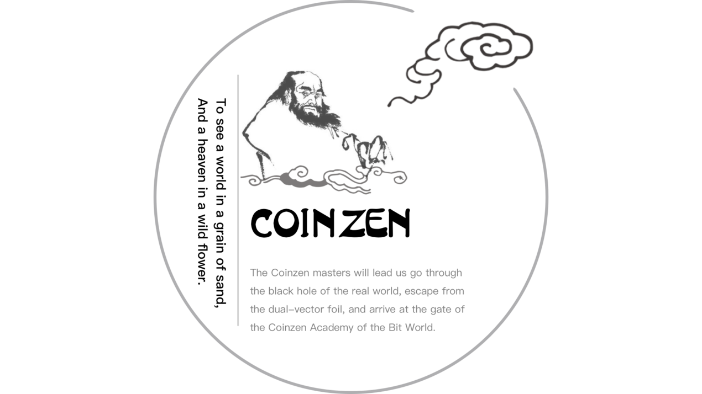 

**Vision**

To incubate a high-quality blockchain super community in the bit world.

1.  Problems need to be solved：How to classify the community members

1.  How to certificate the membership and one’s skill

1.  How to form classified communities quickly according to the member’s skill, region, and cognitive level 

1.  How to establish a blockchain token economy system based on different skills

Solutions：

1.  Design a distributed Q&A system to complete the knowledge structure certification of members

1.  Design a token featured with identify and knowledge structure, based on the blockchain

1.  Design a multi-tasking mechanism to partition members into different circles automatically

1.  Design an efficient task post and acceptance system to form an economic closed loop

**Catalog**

1.  **Project Vision**

2.  **Project Declaration**

3.  **Project Background**

3.1 About Token Organization

3.2 Examples for Token Organization Application Scenarios

3.3 Salute to the Future

3.4 Origin of Coinzen

4.  **Project Specification**

4.1 Project Summary

4.2 Projects Modules 

4.2.1 Coinzen Library

4.2.2 Coinzen 101

4.2.3 Talent Hall

4.2.4 Coinzen Academy

4.2.5 Coinzen Marketplace

5.  **Business Model**

5\. 1 Coinzen Marketplace- Props Trading5\. 2 Synthesize Identity – Burn damo

5.3 Coinzen Academy API – toB Model

5.4 Exchange Trade - Financial Growth

6.  **Characteristics and Corresponding Rights**

6.1 Bit World Genesis Users6.2 Bit World Talent 6.3 Bit World Coinzener

7.  **Technological Realization and Application**

7.1.1 Distributed Storage base on GXChain

7.1.2 Distributed Storage

7.1.3 Identity Verification

7.1.4 Valuable Data Transaction

7.1.5 User Profile7.1.6 Data Exchange Service (DES)

7.1.7 Application Modules 

7.2 Underlying technology

7.2.1 Smart Contract 

7.2.2 Non Fungible Token Protocol

7.2.3 IPFS(Interplanetary File system ) Protocol

7.2.4 Identity Verification Technology

7.2.5 Anti-brush Technique

7.2.6 Presenter and Reviewer Rewards

7.2.7 The Features of GXChain

8.  **Token Economic Architecture**

8.1 Overview of the Token Economic Architecture

8.2\. damo

8.3 Points

8.4 Non-homogeneous Tokens with Proof of Knowledge Identity

9.  **Promotion and Operation**

9.1 Operator

9.1.1 Operational Values

9.1.2 Operational Vision

9.1.3 Operation Plan9.1.4 Target Users

9.1.5 Stages of Development 

9.2 Promotion Plan

9.2.1 Community Promotion

9.2.2 Media Promotion

9.2.3 Business Cooperation

9.2.4 Offline Meetup

9.2.5 Online Activities

9.2.6 Social Platforms

9.2.7 Third-Party Platform

10.  **Milestones**

1a.  **Issuance Scheme**

12.  **Team Members**

12.1 Angel investors and team members

12.2 Consultant

13.  **Glossary**

14.  **Disclaimer**

**1．Project Vision**

Through this community- incubated game (DApp), we strive to engage more people in learning blockchain knowledge cultivate and discover blockchain related talents, and lead players to cognitive iterations, and advance the way to Coinzen Academy. In the game, personal knowledge and social relationships will be loaded on the chain and then can be verified, therefore it can enhance the efficiency of the community members' collaboration, and finally, create a token organization that is suitable for the era of the blockchain.

**2．Project Declaration**

We are not from the Academy of Space but the Coinzen Academy. The Coinzeners will lead us to go through the black hole of the real world, escape from the Two-Dimensional Foil, and arrive at the gate of the Coinzen Academy of the Bit World. We will build up an new network of meaning. Please salute to the future!

**3．Project Background**

3.1 About Token Organization

Because the introduced of blockchain and smart contract, the world is under accelerating, and technological innovation is rapidly evolving beyond humans' understanding of the objective physical world. Shortly, based on the blockchain, smart contracts and a series of protocols, we will create an intelligent algorithm world.

With the consensus that the algorithm determines the distribution, the traditional corporate form will become non-mainstream, and tens of millions or even billions of new “economies” will spring up. After our research, this “economy” is not a simple DAO (Distributed Autonomous Organization) but a completely new form of organization. We call "Token organization."

The economy formed from internal and among the Token organization is called "Token economy”. The Token economy allows all participants to obtain the opportunity for profit distribution proportional to their work. Meanwhile, the people who hold the token will have access to risk returns in the financial field, which is the risk premium for capital.

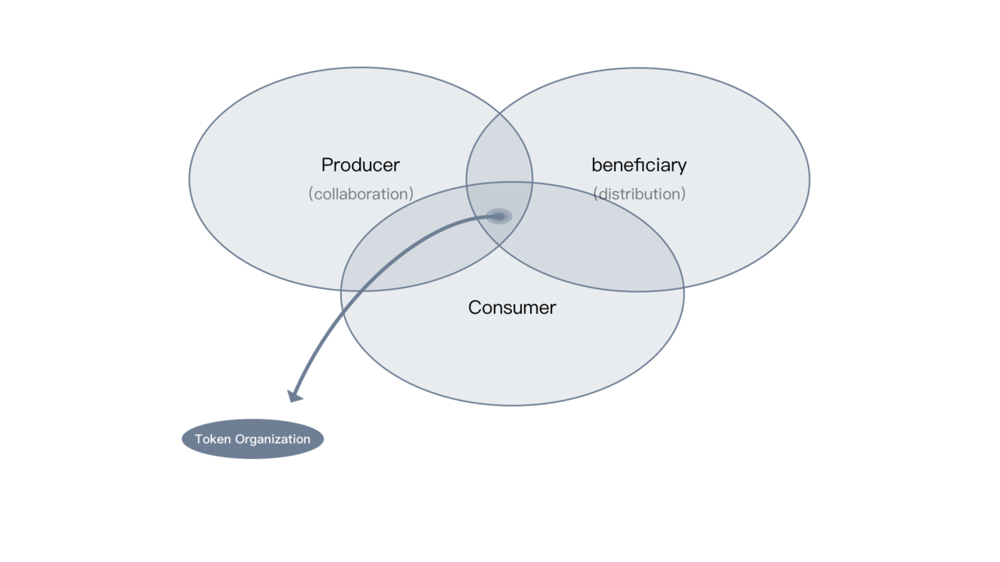 

Figure: Token Organization

3.2 Examples for Token Organization Application Scenarios

There are a group of people who love blockchain technology and are eager to turn the vision of the future into reality. They come to a blockchain community platform through different channels that have to go through the answer screen to enter the corresponding circle.

In this platform, everyone can obtain tokens reasonably by presenting, answering, and reviewing questions. At the same time, because the platform automatically records the parameters of everyone participating in the Q&A part. At different phase, each member will get an identify token which correspond with a personal knowledge characteristic.

One day, community member Little-Q discovers a valuable in English blockchain book; he sees this business opportunity to spread this knowledge to Chinese readers. Translate books into Chinese, and then profit from the sale of Chinese electronic copyright through the content distribution platform. Team participants will share the proceeds. So he posts the following smart contract on the platform:

Smart Contract

{

Mission: Translate《Blockchain Change the World》and publish on blockchain content distribution platform

Requirement:

Translator ten people, proofread two people, illustrator two people, edit one people

Duration: 1 month

Profit: Chinese copyright publish income

Allocation: All members are distributed according to the work submitted

Translation group 60%, proofreading group 10%, illustrator group 10%, edit group 10%, initiator 10%

Deposit: All members need deposit 50% of the estimated profit

Responsibility: Members must complete the task on schedule; otherwise the deposit will be distributed to other members in proportion.

}

Because of the blockchain broadcast, members who hold a qualified identity token can see this message. Everyone can choose to join this contract according to their schedule and take on specific tasks.

The identities of these members have been verified by the platform, and their identity token contains the degree of contribution, performance table, social relationship and other capability parameters on the platform. After the initiator’s screening, 24 members are selected to enter this project team to undertake different tasks.

After one month's hard work of this project team, the Chinese version of this book is officially launched. After the voting, the team decides to upload the Chinese book to a blockchain platform which is dedicated to sharing content copyright and getting the benefit. At this point, as the translation task is completed and the results have been published, the future proceeds will be automatically executed by smart contracts. The translation project team is announced to be dissolved. The project members can go to the platform's DAPP to find other exciting projects.

As the subscription of the book continues to increase on this content copyright platform, the unified account of the project team will continue to receive the profits of copyright. This copyright profit triggers the smart contract immediately which deployed at the time of initiating the translation project, and the token will be exchanged according to a fixed proportion. Eventually, the project initiating platform will continue to give everyone a due remuneration after deducting a specific fee.

In theory, as long as the content copyright platform persists, and new subscribers of the book and complete the payment, all members of the project team will continue to receive revenue forever! The project initiating platform also received a continuous profit.

There are no financial disputes throughout the entire process because all rules are pre-defined on the smart contracts which are immutable and executed automatically. After receiving the profits of the copyright platform, the project initiating platform will automatically execute the smart contract and distribution of benefits to participants in proportions agreed at the beginning of the project. In the process of collaboration, the energy of personnel is saved from interpersonal relations and financial disputes through smart contracts. Everyone just needs to focus on job so as to gain more efficiency.

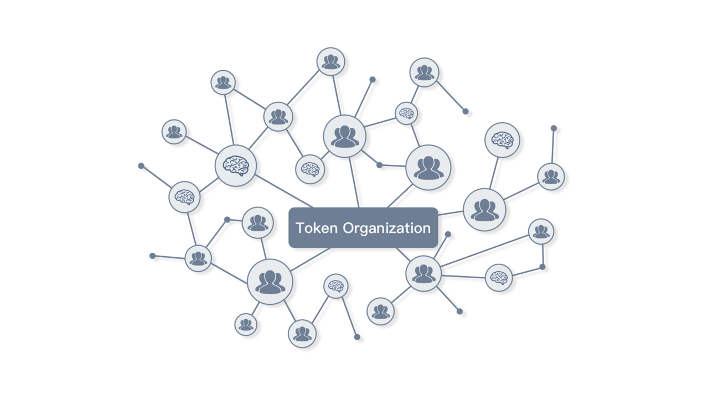 

Figure: Token economy relationship

3.3 Salute to the Future

After reading *Principles, Out of Control, What Technology Wants, A Brief History of Tomorrow, Blockchain Revolution,*  *Blockchain Quantum Wealth,* and other books, we have insight into the future and believe that the token organization will replace the corporation in the future. People become incredibly transparent and collaborate more closely, because of the community consensus and belief in mathematical algorithms which is generated among people, thereby making efforts for common goals.

Humanity has already solved the problem of food and clothing in the future. Manual labor is replaced by robots, and some mental work will be replaced by artificial intelligence. Everyone will have more and sparer time, and creativity, art, and philosophy will shine. Someone has nothing to do and forms to a useless class; someone re-seeks the meaning of life and organizes new relations of production through the community. Everyone in the community is self-driven for a common vision. Everyone seeks meaningful work, meaningful relationships, and a network of values is reconstructed with blockchain technology.

Based on the blockchain technology, through the fulfilling the incentive mechanism by a token organization, it will come up the powerful productivity and creativity. The blockchain allows us to conditionally trust algorithm credits so that decentralized credit can guarantee the collaboration between community members. Due to the improvement of the credit system of the algorithm, distributed collaboration has been supported by the value network. At this time, the efficiency of collaboration across geographies & time zones will increase in multiple times. It can be forecasted that in the future, the production relations generated by the token organization will be subverted, the community will become the cornerstone of the collaboration of the new economy, and the status of the community will become more and more important. We are convinced that “Only those who have the community could get their reign”!

At present, many collaborative relationships are subject to the interpersonal trust, and values are also diverse. However, as the application of smart contracts is highly developed, it will be universalized in the new economy which is full of collaboration. Therefore, we should live in the future, stay one step ahead, and use blockchain technology to make the credit, social relationship, and knowledge on the chain. Therefore, these intangible assets that cannot be measured in the physical world become a trusted source, and the data ownership is verified on the chain, thus reducing the transaction costs inside and outside the new economy, improving the efficiency of collaboration.

According to Metcalfe's law, the value of a telecommunications network is proportional to the square of the number of connected users of the system, and in the blockchain-based bit world, this law is even more critical. In the early stage, we will develop users vigorously and make every effort to build the vitality of Coinzen, to make it form a real platform, thereby it will cause amplifying effect and realize from quantitative change to qualitative change.

The time has come, from the information Internet to the value Internet. Everything Is Just Beginning. A token with incentive mechanism will be applied firstly in the community. At the same time, this token will be regarded as community consensus. As the number of token users increases, it will become more and more valuable.

We have realized that there is a fundamental difference between the token organization and the previous physical world organization long ago. The modern organizations in the world are centralized. A lot of energy in the interpersonal relationship is wasted in various disputes and struggles such as personnel, finances, and interests. Through the features of smart contracts that is immutable and automatically executed, it can extricate these energies from the internal consumption, to increase productivity, and ultimately changes production relations. As an early promoter of the token organization, we will create a super community in the bit world, and make the community members use the emergence mechanism to promote the self-improvement and progress of the new economic organization. After the community is incubated, the Coinzen team will gradually give up its dominance and allow more creative community members to take over. Therefore, from the very beginning, a well-designed token incentive mechanism will enable everyone in the community to become stakeholders, thereby promote the development of the community ecosystem healthy and orderly.

Nietzsche has claimed that God is dead since more than a century ago, implying that human beings have to change their philosophical thinking to adapt to development. It is a subversive change that the human beings change from believing in humanism to believing in algorithmism. It will inevitably lead to a specified period when human society will suffer from some kinds of out of control. For example, taxi drivers will follow in the footsteps of the horses during the Industrial Revolution and will be eliminated by more advanced self-driving vehicles. There will also be more intelligent algorithmic robots to replace white-collar jobs. Once a highly intelligent and unconscious algorithm takes over almost everything and can do better than conscious humans, the useless class will proliferate.

What else can humans do? As long as the results are valid, what is the difference between the algorithm using carbon carrier or silicon carrier? The science and technology has its direction of development. It is out of our control. Maybe it is time for Homo sapiens to retire altogether.

However, Coinzen is a community- incubated game platform that unites people in a virtual community. People in the community stick to the principle of the pursuit of truth and transparency. Through large-scale collaboration, community members jointly challenge the artificial intelligence Alpha Monster created by the algorithm, and eventually, they'll be able to find the meanings of human beings in the field of the consciousness and creativity.

Artificial intelligence is the productivity of the next generation, while blockchain is the production relationships. Does the new economy belong to scientific and technological humanism or dataism? Let's explore together in Coinzen, and escape from the Two-Dimensional Foil!

3.4 Origin of Coinzen

The concept of Coinzen comes from the Dharma House and Tokentalk online collaboration teams both derived from the Chainclub. Coinzen inherits the whole systematic approach of the Chainclub. Through advanced screening of knowledge-based interactive games, combined with the new collaboration technology of blockchain and smart contracts as well as external resources, Coinzen will eventually create a future-oriented blockchain community incubated game platform. All blockchain enthusiasts can find their core specialty in the collaborative relationship of the community, develop their negative entropy kernel, show the truest of themselves, find meaningful interpersonal relationships, improve collaboration capabilities, and inspire creativity, gain spiritual and material wealth finally.

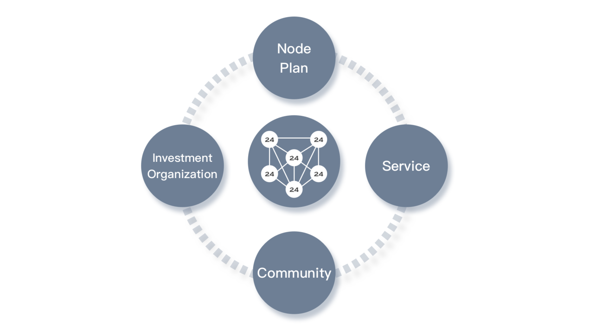 

Figure: Coinzen Academy incubating ecosystem

 **4．Project Specification**

4.1 Project Summary

Coinzen is a lifelong learning blockchain community incubated platform. It is the world's first community-based gamification and game-based realization platform for incubating communities. Today, in the rise of blockchain technology, it is particularly epoch-making to incubate a blockchain community.

Coinzen has the most valuable knowledge identity tokens—identity cards. It utilizes the principle of blockchain technology limited edition cards, like crypto kitty, which allows cards to be transferred and traded. Players can collect damo coins by answering massive knowledge quiz games. Through accomplishment of the tasks, the users can gradually upgrade from newbie to Coinzener, meanwhile get different community identities from different privileges.

When synthesizing identity cards, players will burn damo to activate the smart contract in order to upload all the information stored in the identity card onto GXChain. These including knowledge, social relationships, and resources. Through distributed storage system, on-chain operation, all these information will become reliable digital assets that exclusively owned by the data producers. 

Besides, community members who joined Coinzen Academy can initiate tasks with smart contracts, build teams, collaborate and manage projects online, eventually create value for the whole community.

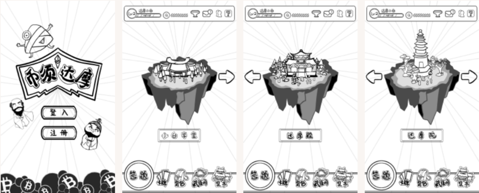 

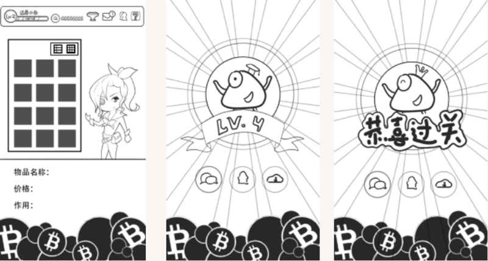 

Figure: Original paintings of Coinzen game interface

4.2\. Projects Modules

4.2.1 Coinzen Library

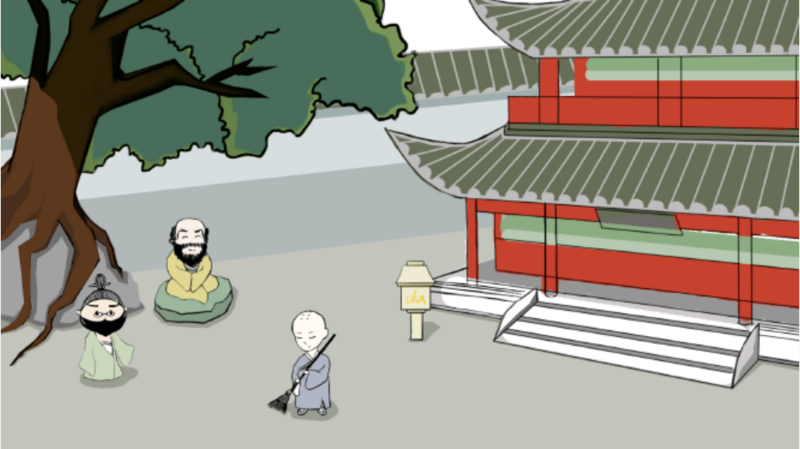 

Figure: Original paintings of Coinzen Library

Coinzen library is a decentralized blockchain knowledge question bank containing hundreds of thousands multiple-choice questions. Each player can choose to participate as a question presenter (Wallfacer) or reviewer (Wallbreaker). The presenters and reviewers work to feed personalized intelligent robots "Alpha Monster" generated by the system. Continuous infusion of question bank will provide support to Coinzen 101, which is a question-and-answer game for new users. Participants can challenge Alpha Monster in Coinzen 101\. Every time an Alpha Monster is defeated, participants can get the rewards and honor.

Coinzen library will create classification groups and set up tags for each question. In the early stage, most questions will be based on blockchain knowledge. Then, the question bank will expand to other subjects and aim to cover a more comprehensive and diversified knowledge spectrum. The more questions a participant answers, the more accurate tag could be constructed on the identity token.

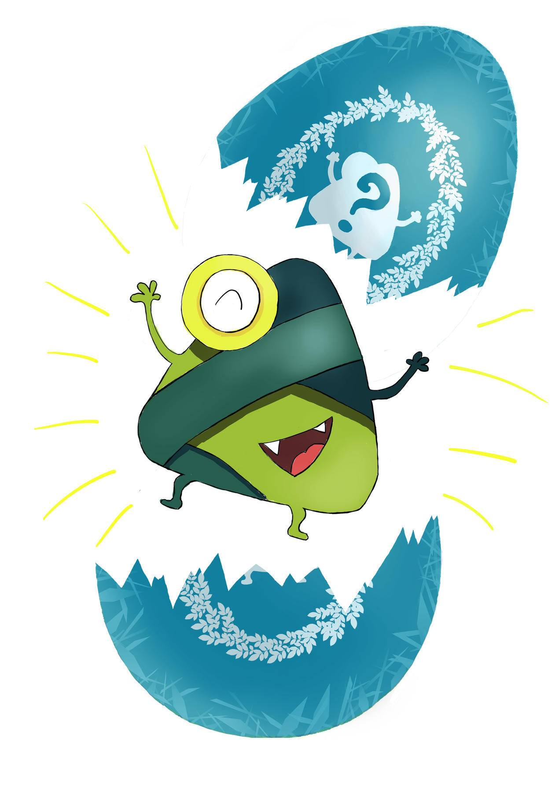 

Figure: Original painting of Alpha Monster

4.2.2 Coinzen 101

Question bank generated from Coinzen library will be used in “Coinzen 101 ". By challenging Alpha Monster，each participants can earn points. Points can be redeemed instantly for damo, and damo holders can consume their tokens to synthesize a knowledge identity token that upload on blockchain—Talent card, which gives the players the permission to Talent hall.

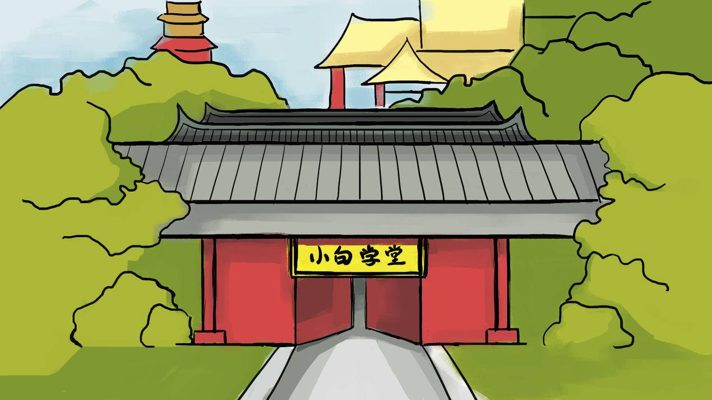 

Figure: Coinzen 101

4.2.3 Talent Hall

Once the players get permits to join Talent hall, they become talents. Talents can reach token issuers and KOLs for in-depth communication. There are only 500 permits available for each Talent hall on a first-come-first-served basis. The permit policy aims to maintain a strong-tie social network within this community better. Talents can join limited amounts of Talent halls that the halls' tag will be labeled on the Identity Token. In each Talent hall, there is also a debate stage, where people are free to sign up for debate. The one who gains most supporters within the time limit will win the debate, and both the winner and his/her supporters can share the rewards. Talents can also choose to watch other Talent Halls' debates, but are not allowed to participate in. Talents can consume damo to create a knowledge token - Coinzen card and put the debate result on the chain to get permits to join Coinzen Academy.

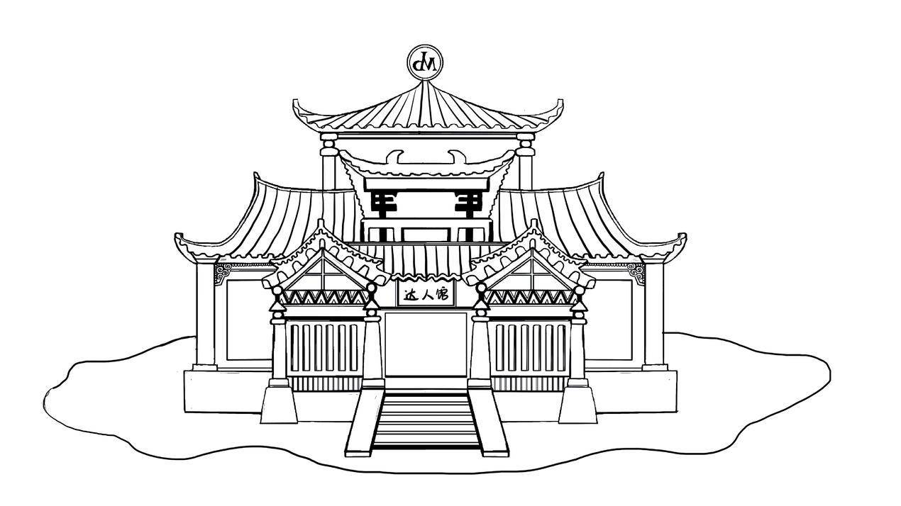 

Figure: Talent hall

4.2.4 Coinzen Academy

Once the players get permits to join Coinzen Academy, they become a Coinzener. Each collaboration team in the Coinzen Academy is limited to 24 persons. Coinzen Academy is composed of several labs categorized by knowledge types, or by projects. For example, there could be an AI 001 lab, a Crypto-punk 010 lab, or a game development 011 lab. In Coinzen Academy, Coinzeners are equipped with better ability to cross the structural hole. Coinzeners can at his/her discretionary publish a bounty program to recruits various talents to work with him/her. Coinzen Academy will evolve itself into an online incubator that incubates blockchain startup projects. Every piece of information about each project will be confirmed on chain, and once approved, it's forever. 

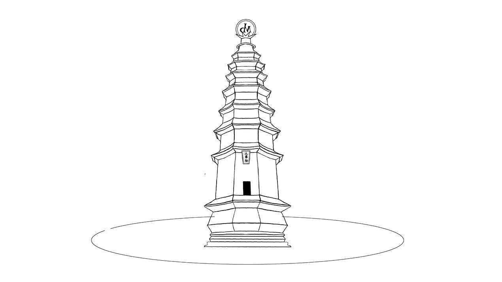 

Figure: Coinzen Academy

4.2.5 Coinzen Marketplace

Players can trade props (C2C), buy props (B2C), and auction their ID cards in the Coinzen marketplace.

**5．Business Model**

5\. 1 Coinzen Marketplace- Props Trading

Coinzen marketplace acts as a trading platform that players can trade Coinzen cards or buy damo with other digital assets. The legitimate token in the Coinzen marketplace is damo, and fees incurred will all be settled in damo as well. Coinzen will then burn these settled damo.

5\. 2 Synthesize Identity – Burn damo

In synthesizing an identity card which is based on ERC721, players need to burb damo. The burnt damo will be transferred to the address zero, and no one possesses the private key.

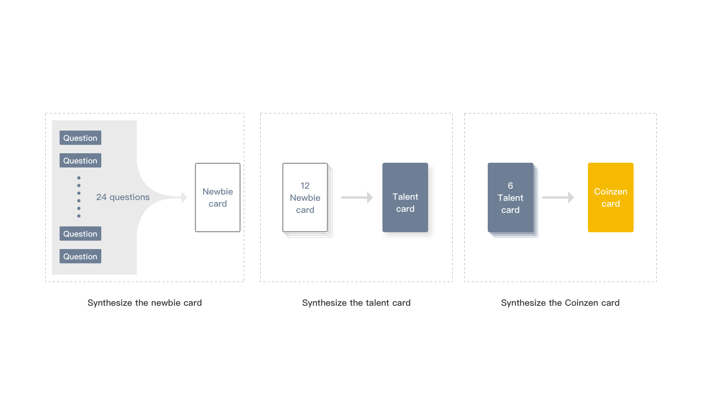 

Figure: Demonstration on how to synthesize an identity token

5.3 Coinzen Academy API - toB Model

Coinzen Academy provides charged API for blockchain project owners. Blockchain project owners can use this API to manage their fans and community members, so as to promulgate the platform, and encouraging the users to initiate their co-working projects. At the same time, the Coinzen master who initiates the project can certify the project members. The project certification data will be on the chain, it will accurately increase the fan rating.

5.4 Exchange Trade - Financial Growth

In a circulation system that is distributed based on player contribution, it will not only provide services meeting player demand, but also will accompany with recycle mechanism. The damo will become more and more valuable. The freely traded damo will be decentralized assigned by the Coinzen marketplace.

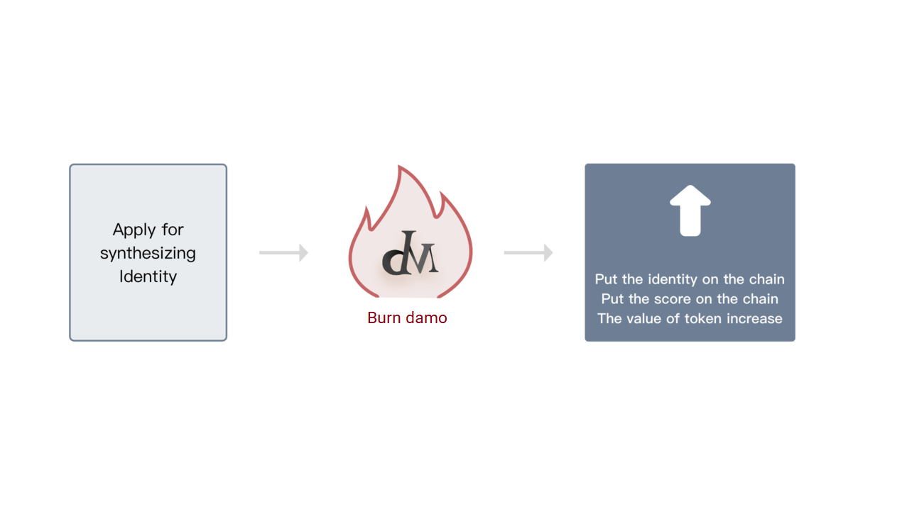 

Figure: Synthesize identity token

**6．Characteristics and Corresponding Rights**

6.1 Bit World Genesis Users

We will send out 9999 invitation codes during the first round. The first 9999 users accompany with Genesis Tag. After he(She) sign up with the invitation codes. He(She) will become Genesis User, and will have exclusive privileges. Every Genesis User can invite up to 8 newbies to sign up as their followers. They are supposed to act as mentors to guide their followers. Every time the followers earn damo by participating in Coinzen 101，Genesis Users can acquire 10% of those earning points. A Genesis User must find his/her negative entropy kernel, keep reinforcing and invite people who share the same vision.

6.2 Bit World Talent 

Whenever Genesis Users or followers upgrade to Talents, a Talent tag will be associated with him(her). After that, a Talent can each invite up to 16 followers. Furthermore, they can also acquire the bonus points from the followers of their followers who have become Talent. The more followers who have upgraded to Talents, the stronger the ability of the Genesis User to cross the structural holes.

6.3 Bit World Coinzener

Whenever Talent upgrade to Coinzener, they can each invite up to 24 followers. Coinzener can also acquire the 10% rewards from their followers. The more followers who have upgraded to Coinzener, the stronger the ability of the Genesis User to cross the structural holes.

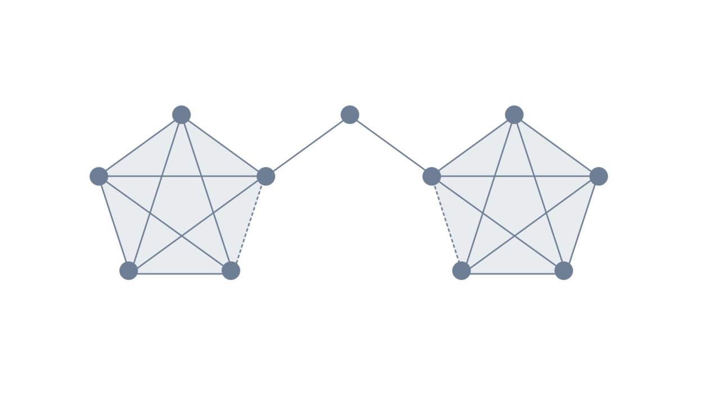 

Figure: Structural Holes

**7．Technological Realization and Application**

Coinzen selects GXChain as the underlying technology for the entire application. The GXChain is based on Graphene as the underlying technology. It has a high-performance, highly scalable public blockchain, and can handle 100,000 transactions per second theoretically.

7.1 System Framework

Coinzen selects GXChain as the underlying technology for the entire application. The GXChain is based on Graphene as the underlying technology. It has a high-performance, highly scalable public blockchain, and can handle 100,000 transactions per second theoretically.

7.1 System Framework

7.1.1 Distributed Storage base on GXChain

For a traditional centralized server, the database are often attacked by hackers, causing vicious incidents such as system failures or the leakage of personal data. To ensure the security and reliability of stored data, Coinzen adopt BaaS from the GXChain as a storage solution.

Blockchain-as-a-Service (BaaS) means using of blockchain-generated data to provide search queries, task submissions, and a series of operational services within blockchain to solve various types of pain points that cannot be conquered by existing applications.

On the GXChain, BaaS provides developers with the following services as a sidechain expansion method: data storage on the chain and verification of results. The data content is stored and certified on the IPFS. The hash address of the data and the identification information of the file are preserved on the main chain of GXChain. The data private key guarantees that the data control power belongs to the user. 

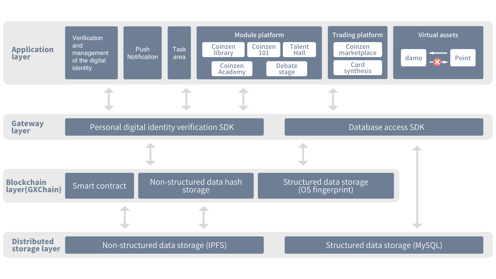 

Figure: System Framework

7.1.2 Distributed Storage

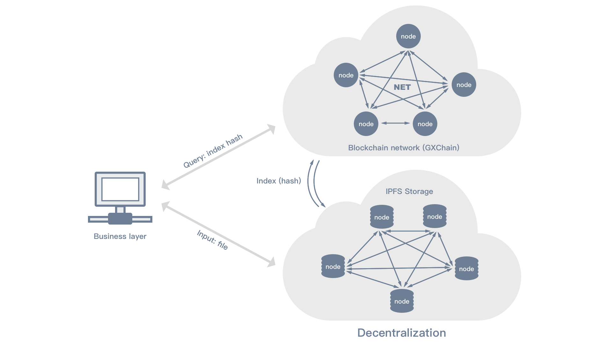 

Figure: Distributed Storage

IPFS storage plan

Storage: Business layer processes the documents by using the IPFS storage system. After being processed, the file will be assigned a new name: " file content hash" (aka. index hash). In the meantime, the files stored in the databases will be saved on various nodes using sharding strategy.

Preservation and evidence: The blockchain layer (GXChain) stores index hash and other related information (such as operator, operation time) that has been processed by IPFS

Read: Call a BaaS API from the blockchain layer (GXChain) to query a file by its hash value, and extract the file.

Nodes: Files are stored on different nodes by sharding. The more one file is accessed, the more the nodes will store its copy during the whole system operation process so that it is more likely to be extracted even if there are only a part of nodes online.

Strength: Adopt the latest technology of distributed storage, the central server node is removed, and it is no longer under its control. The ownership of the data belongs to every user.

7.1.3 Identity Verification

The use of Coinzen various applications requires users to carry out real-name authentication. Coinzen creates a universal digital identity, called G-ID for each user through the GXChain. G-ID is a standard user identity certificate in the GXChain ecosystem. The operation behavior and achievement of the user in the Coinzen will be associated with the G-ID. If the user commits cheating, it will be recorded as negative information and significantly increase the user's cheating costs.

7.1.4 Valuable Data Transaction

Coinzen processes all data in the system with IPFS technology, and it can propagate value within the closed loop node.

Carmos Moreira indicates that though your identity is yours, but the data generated by your identity on the internet belong to someone else. Internet companies regard you as just a bunch of data. They keep track of your behaviors on the internet. Through collecting your behavioral data, they sketch out your virtual profile and provide targeted services to you. However, you eventually pay for the convenience by giving up your privacy. Our team is not quite a fan of those ideas that everyone should abandon their privacy; we intend to believe that privacy is the foundation of a free society.

What if you can control the " virtual you"? 

It would be your avatar. It is composed of every piece of information in your life, but your information is well protected in a black box. You can even trade your behavioral data for money. When people attempt to visit your data, you can decide whether to disclose specific information to them. Your avatar will act as a guardian to manage and protect data in your black box. 

Coinzen allows you to set up different levels of access authority on your personal information. For individual information, you can set a price and charge on those who would like to acquire your data. In the meanwhile, we promise to secure the data during transaction. 

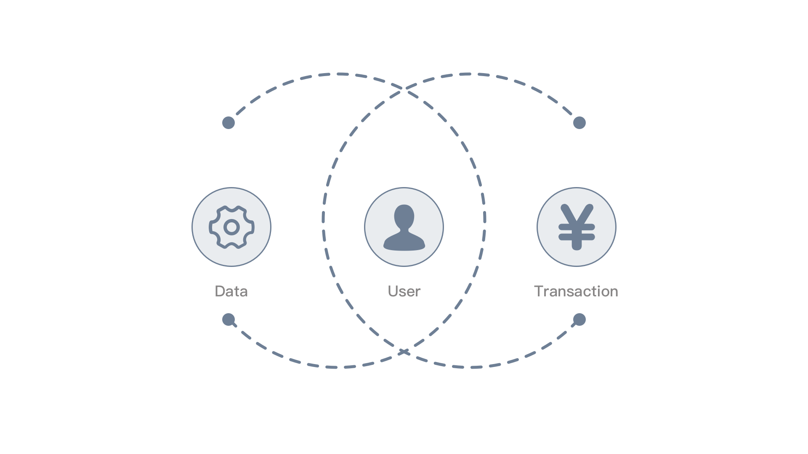 

Figure: Valuable Data Transaction

7.1.5 User Profile

When playing various of Coinzen advanced games, users will generate various types of secondary data. After these data on the chain, the corresponding identity tags will be corresponded to the user's general digital identity (G-ID) account system. These coarse-grained identity tags can reflect the user's behavior. For example, in the presenter game of the Coinzen Library, a person who likes setting financial knowledge questions and has the highest score can get a label of a financial expert. If one would like to set encryption algorithm questions with entry level, he can get a label of cryptography beginner. Coinzen will divide the user's knowledge level and behavioral habits into a different rating, and accurately provide content for users who are interested in. After the user's rank is upgraded, Coinzen will recommend users to join the collaboration of the token organization, according to the users' identity tag, as well as the users' behavior record of all the experiential processes.

7.1.6 Data Exchange Service (DES)

Using the data exchange market provided by the GXChain, users have the right to choose how to develop their data. For example, in the future when players join the collaboration team of Coinzen Academy, if there someone needs to verify the original data, they have to submit the data transaction through DES and pay the corresponding damo to the data owner. Only after the data owner has authorized, the entire data query and transaction process can be completed. If the data owner rejects the transaction request, the data transaction will not be achieved. DES guarantees that the data owner completely dominates the access rights of their data.

7.1.7 Application Modules 

Distributed task assignment with smart contracts

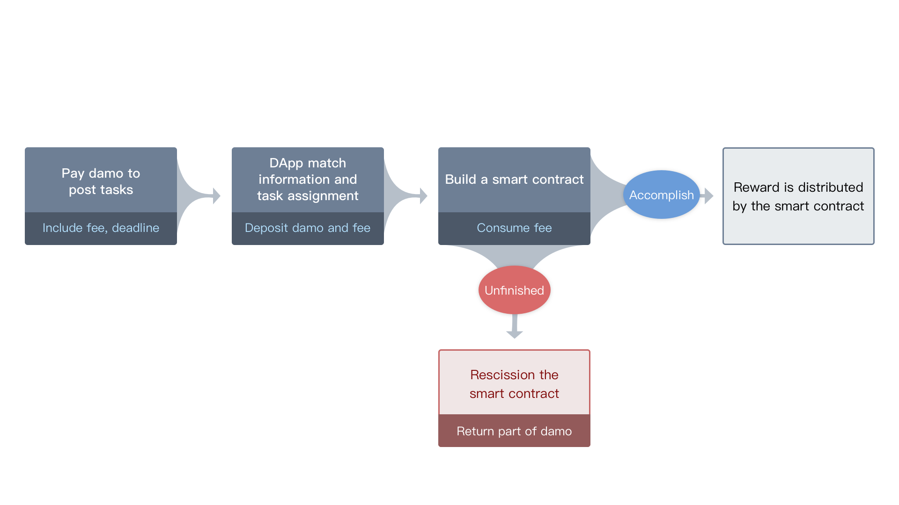 

Figure: Task assigning process

Coinzen marketplace with smart contracts

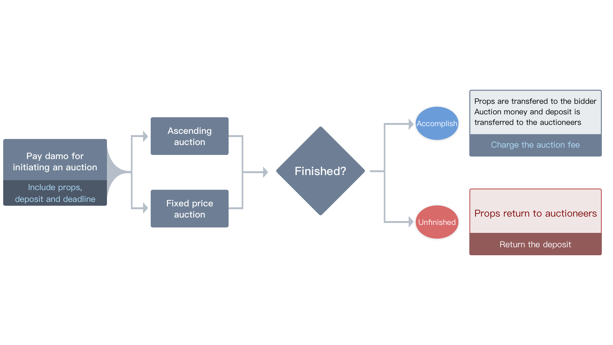 

Figure: Auction props

A. Ascending auction mode: Auctioneer announces an opening bid and the price increases incrementally over time. The highest bidder at any given moment is considered to have the standing bid, and when the auction ends, the standing bid becomes the winner. 

B. Fixed Price mode: Sellers sell the merchandise by putting a price tag which allows buyers to make the transaction as quickly as possible.

Coinzen platform will charge a service fee on every transaction in the marketplace.

7.2 Underlying technology

7.2.1 Smart Contract 

A smart contract is a computer protocol intended to digitally facilitate, verify, or enforce the negotiation or performance of a contract. Smart contracts allow the performance of credible transactions without third parties. These transactions are trackable and irreversible. Nick Szabo first proposed smart contracts. Smart contracts aim to provide security that is superior to traditional contract law and to reduce other transaction costs associated with contracting.

7.2.2 Non Fungible Token Protocol

Typically, tokens on blockchain are homogeneous. Each token represents the same amount of value. The concept is like cash because every dollar has equal value. Non-homogeneous tokens are one-of-a-kind. In the game "Cryptokitties", for example, every cat is born with unique genes. One cat is a Non Fungible Token (NFT). The unique characteristics made some cats born with rare genes become famous and have high collection value. Non-homogeneity is ubiquitous, such as every book in the library, every pet in the pet shop, every song, every flower in a flower shop. At present, non-homologous tokens have been widely used in blockchain games, such as encrypted cats and encrypted cities.

7.2.3 IPFS (Interplanetary File system) Protocol

Interplanetary File System (IPFS) is necessarily a content-addressable, versioned, and peer-to-peer hypermedia distributed file system and transport protocol. The goal is to complement or even replace the hypertext media transport protocol (HTTP) used in the past 20 years, hoping to build a faster, safer, more free Internet era. It can reduce storage and bandwidth costs and provide a distributed cache solution for traditional applications.

IPFS is a secure and reliable file sharing tool that uses peer-to-peer (P2P) communication to build a network featured with distributed file system. It can store file content in a distributed network in an encrypted manner, then address it according to the hash value of the file content and extract it. Therefore, it can adequately protect users' privacy while freely sharing data.

Distributed file network system built by IPFS: If a new file is added to a network node, it will be assigned a unique "name" which is the hash value of the file content (file fingerprint, created according to the file content). Even if the contents of two files are only one character different, the files have different hash values. So IPFS is based on the file content to address, as compared with the traditional HTTP protocol which is from by domain name addressing. In addition to storing the raw data, each node will also save a hash table used to record the location of the file. When querying a file, IPFS will firstly address the hash value of it which is unique in the entire network and then extract the file. For a file, the more it is accessed, the more nodes will store its copy during the whole system operation process so that it is more likely to be extracted even if there are only a part of nodes online.

Also, duplicate files in the Coinzen system will be removed from the entire network and version management is performed for the files. It allows to record the history of changes to each file, and the file can return to every previous version to view data.

There is no upper limit on the IPFS storage space of the Coinzen system. The storage size is directly proportional to the nodes added.

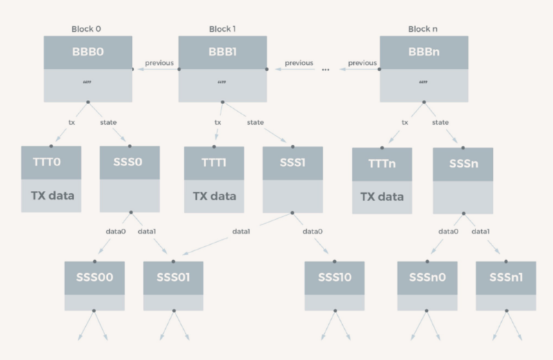 

Figure: The Architecture of Merkle tree structure based distributed storage

7.2.4 Identity Verification Technology

In order to perform the digital identity verification, we integrate with a variety of method coming from third-party, all of these methods are based on the blockchain.

A. Biometric identity - based authentication. It refers to the integration of existing biometric identity services based on the unique features of each person's body, such as fingerprints, irises, voiceprints, and facial features.

B. Public key encryption algorithm-based authentication. It means that one party in the communication hold the public key and the other one has the private key. The private key is used to encrypt the specific data, and the verifier uses the public key to decrypt the data. If the decryption is successful, the user will be considered legal. Otherwise, the authentication fails.

C. Social network-based authentication. The social network (SN) or social networks site (SNS) is web application service forms which originate from the idea of the social network relation system and aim to help people to establish a social network. Social authentication is a new type of authentication based on social networks. The traditional security system mainly implements user authentication in three ways: what the user knows, such as the password; what the user has, such as a hardware token card; what the user is, such as the user's fingerprint and other biological characteristics. Social authentication becomes the fourth method, which achieves the system authentication by who the user knows.

7.2.5 Anti-brush Technique

A. The similarity degree assessment adopts the “edit distance” (somewhere also called “the Levenshtein distance”) comparison method. The distance refers to the minimum number of edits (replace, insert or delete one character.) required to convert from one string to another. 

B. How to calculate the minimum number of edits between a pair of strings is the core part of editing distance. According to the characteristics of the problem, we can use the idea of dynamic programming to calculate them. For instance, the recurrence calculation formula for two strings a=a1a2⋯an，b=b1b2⋯bm is shown following:

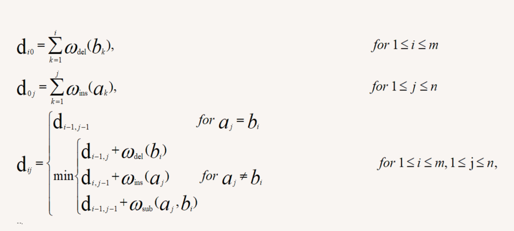 

7.2.6 Presenter and Reviewer Rewards

A. The presenter will receive a random token reward after his question is approved.

If( Pass )

Value = Random(min,max)

else

Value = 0

B. After the subject of the question is examined and the result is the same as the result of the review, the reviewer obtains a reward;

 If( Same )

Value = Random(min,max)

else

Value = 0

7.2.7 The Features of GXChain

1.  High performance and scalability

We adopt GXChain as blockchain technology. GXChain is a public blockchain with high concurrent processing capacity. It generates a block every 3 seconds and has a processing capability of up to 100,000 transactions per second. Considering the possibility of business growth on the chain in future, GXChain supports horizontal extending that can quickly expand transaction processing capacity per second and do not require the fork to reach the consensus.

1.  Dynamic adjustment of parameters

GXChain can modify system parameters without a fork, and realize the dynamic adjustment of global parameters such as block size, block generation rate, and handling fee through consensus voting.

For example, a block is generated every 3 seconds, and parameters can be dynamically adjusted to be produced per second. The current block size is 2 M, and it can be dynamically adjusted to a large block, such as 8M.

1.  Data supply

The decentralized data exchanges developed on GXChain supports data transactions and exchanges in many fields, and businesses and individual developers can buy and use these data.

1.  BaaS service

GXChain also provides some support such as the BaaS (Blockchain as a Service) interface for file storage and authentication. The developer can develop many real-valued blockchain applications based on the abundant BaaS-API, data transaction API, and native API.

1.  Application development based on GXChain

Compared with other public blockchains, applications developed based on GXChains have data support from various industries, allowing developers to make more practical commercial applications.

1.  Digit Asset Issuing

The issuing standards for the digital asset on GXChain allow developers to issue and circulate applications freely.

1.  Open source code

GXChain and related code have been completely open source on Github. ([<u>https://github.com/gxchain</u>](https://github.com/gxchain)<u class="ql-author-9667207" style="color: rgb(0, 0, 0);">)</u>

**8．Token Economic Structure**

8.1 Overview of the Token Economic Architecture

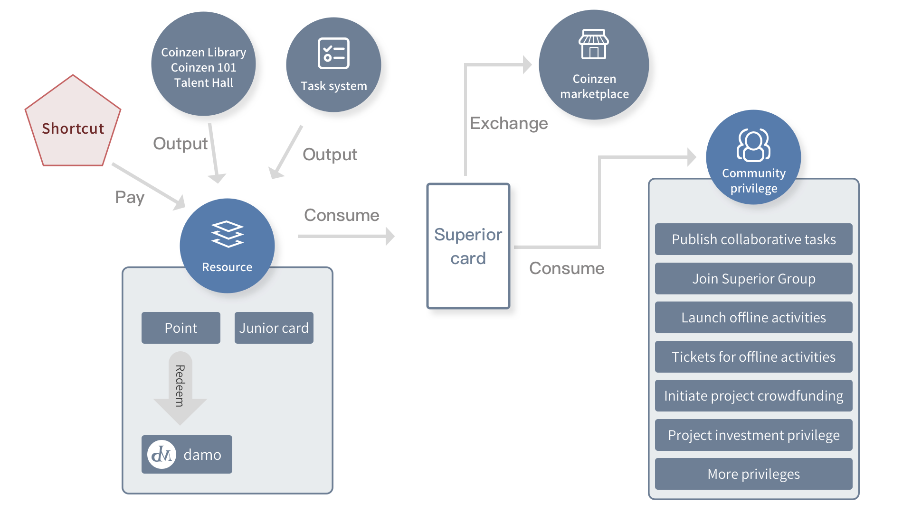 

Figure: The Architecture of Token Economics System

To meet the value of the token investment and the circulation within the ecosystem, Coinzen adopts the TOKEN + Points mechanism, including damo with investment value, Points with system billing function and non fungible token with proof of knowledge identity.

8.2 damo

 It is the value medium for the smart settlement system to circulate on the exchange. The holder can enjoy the investment income through its circulation, and at the same time serve as a credential to use the system. Damo is a one-time quantitative issue and will never be reissued. With the increase in the number of users, the value of damo will continue to increase, and the willingness of investors to hold damo will continue to rise.

8.3 Points

 It is the system's billing token. Points mainly play the role of accounting in the system and do not circulate directly in the transaction. Points can be redeemed instantly for damo following the market value, and the holder of the points has the priority to convert.

8.4 Non Fungible Tokens with Proof of Knowledge Identity

It is a community token. It’s common to upload the data to the blockchain, but the data is rare to involve own knowledge information. We have found the model of knowledge proof on the chain. The user's assessment of the scores in each area of the Coinzen community is written in the tokens of the blockchain. As a proof of knowledge and experience, it can also serve as an admission ticket for the senior community in the future. Proof of knowledge identity non fungible tokens can be traded as particular commodities.

**9．Promotion and Operation**

9.1 Operator

9.1.1 Operational Values

Coinzen is a community- incubated game platform for cultivating participants' brain systems through interactive quizzes, debates, and direct incentives. Therefore, each participating partner will find the mental flow through the unity of knowledge and action and master an approach to creating value through links in a future business ecosystem.

Therefore, the core value of Coinzen operation is to allow everyone involved to find happiness and sense of meaning. They can also use the platform to build a balance between joy and a sense of purpose/meaning.

9.1.2 Operational Vision

The vision of Coinzen is to incubate the new generation of organizations, which is Token Organizations. The ideal process is to compete through games such as the quiz system in Coinzen, and then many groups of communities consisted of 24 people will emerge, called the “Coinzen Academy.” Then each “ "Coinzen Academy" was created in collaboration and naturally formed the most potent group of Token organization and became an influential value-output group.

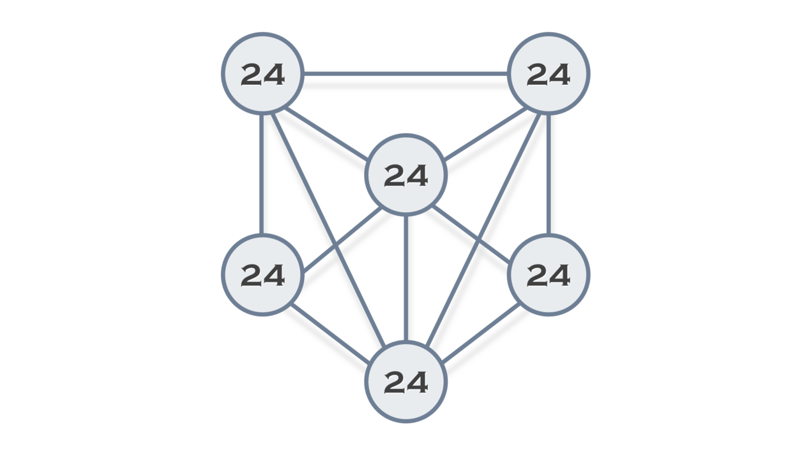 

Figure: Coinzen Academy Collaboration

9.1.3 Operation Plan

In the early stage, we will develop a blockchain knowledge education platform, and in the mid-term, we will develop a multidisciplinary knowledge education platform and later create a Coinzen blockchain incubator.

9.1.4 Target Users

People who are interested in the blockchain, who are interested in the community collaboration, who are keen on learning, and who would like to find value in the blockchain domain.

9.1.5 Stages of Development 

Early period: To increase the scope of newbies, improve the quality of users, and raise the frequency of connections between users.

Mid-term: To upgrade newbies to Talents and create individual influence power in blockchain.

Late period: The project will run automatically, diluting the power of the operations team, and strengthening the power of community collaboration, so it will eventually be token-operated, with token-based incentives for the community. Due to the damo consumption in the game, the damo held by each token holder will appreciate with the development of the community.

9.2 Promotion Plan

9.2.1 Community Promotion

Starting from the existing 6,000-person paid community at Chainclub, through the community incentive approach, the project will be quickly sent to the members of the community through the Coinzen Library blockchain quiz to conduct a cold start of the project.

Through opening the API and cooperation with influential blockchain communities，Coinzen provides blockchain quiz game service to achieve the effect of introducing flow.

9.2.2 Media Promotion

It will quickly establish a strategic partnership with blockchain media to create a media promotion matrix by the resources of Token talk which is We-Media platform of Chainclub.

9.2.3 Business Cooperation

Coinzen will quickly connect with the project partners of Chainclub, Askingblockchain, and Higher Interviews to provide project experts with a customized professional question bank to enlarge the number of their fans.

9.2.4 Offline Meetup

Together with Chainclub branches in China and overseas to create the offline meetup, let more people understand the project.

9.2.5 Online Activities

The Coinzen system will add some small games from time to time, active community atmosphere, pull fans.

9.2.6 Social Platforms

The team will release official information on time on Chinese and international social platforms.

9.2.7 Third-Party Platform

Coinzen will work with third-party portals to obtain flow, such as GXchain, Oraclechain Eos Pocket, NetEase blockchain games and so on.

**10．Milestones**

Chaos

At first, the world was in chaos, until the genesis Coinzener separated the world into heaven and earth. This stage is the time when the Coinzen team create the world, build an infrastructure of the Coinzen world, connect external project resources, and introduce enough people to form the community.

Sublimity

Naturally exquisite realm. At this stage, all the public blockchains which have access to the Coinzen world will be connectivity. So, each related resource of the public blockchain can interact and support each other.

Epiphany

Epiphany and leap. At this stage, the player who becomes Coinzener will be able to call various privileged resources on Coinzen to achieve their leap.

2018 Q3

Coinzen Library launches

Coinzen library (blockchain version) launches

2018 Q4

Coinzen 101 launches

Coinzen 101 (blockchain version) launches

damo goes listing on exchanges

2019 Q1

Talent Hall launches

Identity cards synthesis function launches

Coinzen Market launches

Coinzen Academy launches

**11．Issuance Scheme**

Name: Coinzen

Token symbol: damo

Issue Quota: 0.1 billion

Official Website: [<u>http://coinzen.top</u>](http://coinzen.top)

Allocation proportion

Founding team, 20 million

One year lock

Award for the Technical team, operations team and consultant team

The community foundation, 15 million

15 million is managed by the Chainclub Foundation for the development of the community, as well as to increase awareness and activity.

Coinzen Foundation, 15 million

Operated by five persons, for public welfare, brand promotion, and some immediate response.

Angel round (finished), 10 million

Early investment, for project initiation, the primary target is the founding team.

PE, 25 million

Used for operating expenses and expenses for listing on exchanges

Promotion and operation, 15 million

Used for brand promotion

**12．Team Members**

12.1 Angel investors and team members

Weilong Wu

Graduated from Central South University

Founders of Coinzen

‎Chainclub co-founder

Elastos Capital director

Token talk core member 

GUSBU co-founder

Minhua Ouyang | Bonny AY

Co-founder of Coinzen

Successive Entrepreneurs in Education Field

Former Guangdong Province General Manager of a NEEQ-listed education entrepreneurship

Chainclub Incubation Division CEO

Token talk core member 

Chao Ma

Co-founder of Coinzen

11-year Full Stack developer 

Former general manager of a Shenzhen branch of a group company

People's Posts and Telecommunications Press technical writer

Partner of a traditional technology company, long-term technical support for Huawei and ZTE.

Yihang Li | Smith

Co-founder of Coinzen

Six years of C++ development, blockchain geeks, focus on Hyperledger, Hyperledger, Ethereum, eos development

Di Wu

Graduated from Jilin University

Former senior engineer in cloud computing and blockchain at Huawei 

Proficient in bitcoin and fabric architecture.

12.2 Consultant

Consultant Team

Higer

Master graduated in Chinese Academy of Sciences

Chainclub founder

Superskynet technical consultant

Askingblockchain founder

Former Agricultural Bank of China 8 years of core system development and blockchain technology research and applied R&D experience

Charles | Caicai Zi

Coinzen consultant

Master of Central South University

QYB & Wallet Development Leader

Bitcoin programming class, Bitcoin source study class lecturer

One of the authors of the second Chinese edition of Mastering Bitcoin

Sia Wiki Chinese Translator

Andy

Master of Yanshan University

Founder of Blockchain Lecture Hall

Lecturer of Blockchain Landing Application

Has participated in finance, government affairs, industrial control, medical care, etc. multi-domain blockchain application project

Blockchain Product Design Expert

Shisheng Wang

Coinzen consultant

Chainclub co-founder

Chengdu branch chief of Chainclub

Blockchain Media Token Talk founder

Editor-in-chief of Chainclub official column in JianShu

More than ten years of project management experience

Cooperate with telecom giants such as China Telecom, China Mobile, and Huawei many years

Xiangpeng Wang | Bruce

Coinzen investment consultant

Dharma member of Chinaclub

Bruce Investment Course lecturer

Blockchain Fund IOB Manager

OMG Quantum Chain Early Investors

Hao Wei | Ares

Coinzen investment consultant

University of Electronic Science and Technology Master of Software Engineering

Audley Blockchain Institute China CEO

Bitcoin early investors

Equity Investment Fund Partner

Richard Fan

Coinzen investment consultant

Dharma member of Chinaclub

Australian National University of South Australia MBA

He has served as marketing manager of Philips China Investment Co., Ltd.

US Bridgeport Capital LLP Hedge Trader

Gao Shen Assets Joint Venture

**13．Glossary**

13.1 DAO

Abbreviation for Distributed Autonomous Organization, a blockchain-based organizational structure such as ant colony, swarm, both can be called DAO.

13.2 Token

A trusted credential based on the underlying technology of the blockchain and is a carrier of value.

Token Organization: DAOs that have previously placed smart contracts for profit distribution based on people's consensus and blockchain technology as a credit guarantee. Token Organizations are mostly from the virtual community, but they are higher than the virtual community. Token Organization emphasizes that the collaboration is based on the consensus to create value. It is a new production relationship.

13.3 Dapp

Distributed applications

13.4 Virtual community

Defined by Howard Rheingold in the book The Virtual Community: Homesteading on the Electronic Frontier (1993): People can connect with each other through the Internet, breakthrough geographical restrictions, communicate with each other, share information and knowledge, and form similar hobbies and emotional resonances. The special relationship network is the "virtual community."

13.5 Alpha Monster

Coinzener's common opponent. After winning the collective action, Coinzener will increase his/her points.

13.6 Negative entropy kernel

The core value and methodology of life that is maintained and developed by taking negative entropy from the external environment

13.7 Two-Dimensional Foil

A typical dimensionality attack (dimensionality reduction attack) weapon that appears in famous Chinese science fiction writer Cixin Liu's Death's End (Remembrance of Earth's Past). The universe is in the state of dark forests, so it is a primary devastating weapon among interstellar civilizations.

13.8 Stakeholder

Anyone whom affected by organizational decisions and actions, It could be a relevant to the organization, such as shareholder, loaner, employee, customer,etc.

13.9 Dharma

In the Northern and Southern Dynasties of China (420-589), Zen Buddhism, known as Bodhidharma, was paraphrased as meaning of insight. According to the *Continuation of The Biographies of Eminent Monks*, he is a south Indians belonged to the Kshatriya caste and understood Mahayana thoroughly, and praised by meditator. Damo is a transliteration of Dharma.

13.10 Mental flow

The state of mind that a person performs when he is focusing on activity in psychology.

13\. 11 Bit World

It is a bit-based mapping of the physical world based on the blockchain consensus algorithm to generate credits. It is a world in which people's property and other goods are tokenized. It has a more efficient collaborative relationship and a more fair and transparent production relationship.

13.12 Structural cave

It refers to the gap in the social network, that is, one or more individuals in the social network have direct contact with some individuals, but they do not have direct contact with other individuals. In other words, there is no direct relationship or interruption of the relationship, from the whole network, it looks like there are caves in the network structure.

**14．Disclaimer**

At present, the attitudes and policies of the major countries in the world are not explicit about the blockchain projects which use cryptocurrency financing, and there is a possibility that investors may lose due to policy reasons.

The transaction of digital assets, including damo, has exceptionally high uncertainty and lacks proper supervision. All cryptocurrencies are subject to sudden rise and fall and are subject to the risk of dealer manipulation.

The Coinzen team will spare no effort to achieve the goals set out in the white paper and actively explore the longer-term development space of the project. However, due to the uncertainty of the external environment and internal resources, we will retain the power to iterate the content described in the white paper. We did not take the obligation to inform all the changes in the contents of the white paper. Participants are supposed to update themselves through relevant channels.

In addition to the risks above, since cryptocurrency investment is still a brand-new field, there may be various risks that we have not yet mentioned or have not anticipated. Please participate rationally with the full understanding of risks.

Dharma Chain Technology Co.，Ltd owns the ultimate interpretation right of the white paper

Company Name：Dharma Chain Technology Co.，Ltd

Date ：2018-07-21
