**币须达摩 DAPP**

**Coinzen DAPP**

**白皮书**

**White paper**

coinzen.top

 

 

 

币须达摩团队

Coinzen Team

版本：V1.0

Version: V1.0

更新时间：2018.07.15

团队保留对白皮书描述内容进行迭代的权利

The team reserved the right to modify the description of the white paper.

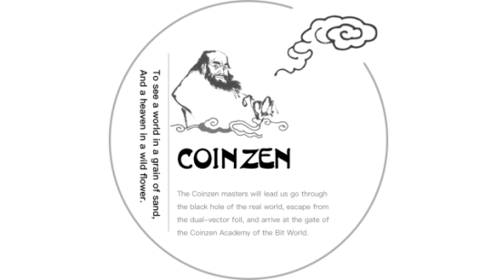

目标：

Vision

育成比特世界高质量的区块链超级社群。

To incubate a high-quality blockchain super community in the bit world.

要解决的问题：

Problems need to be solved：

1.  社群成员分级筛选

How to classify the community members

2.  成员身份及技能认证

How to certificate the membership and one’s skill

3.  对相同技能，地域，认知层次的成员迅速组成分类社群

How to form classified communities quickly according to the member’s skill, region, and cognitive level 

4.  建立基于不同技能的区块链通证经济体系

How to establish a blockchain token economy system based on different skills

解决问题的方法：

Solution：

1.  设计一个分布式问答系统，完成成员的知识结构认证

Design a distributed Q&A system to complete the knowledge structure certification of members

2.  设计一个基于区块链的身份及知识结构通证

Based on the blockchain, design a token featured with identify and knowledge structure

3.  设计一个多任务系统，为成员自动分类引流到不同圈子

Design a multi-tasking mechanism to partition members into different circles automatically

4.  设计一个高效的任务发布及承接系统，形成经济闭环

Design an efficient task post and acceptance system to form an economic closed loop

 

目录

Catalog

\1. 项目愿景

Project Vision

\2. 项目宣言

Project Declaration

\3. 项目背景

Project Background

3.1 关于通证组织

About Token Organization

3.2 通证组织应用场景举例

Examples for Token Organization Application Scenarios

3.3 致敬未来

Salute to the Future

3.4 币须达摩由来

Origin of Coinzen

\4. 项目详述

Project Specification

4.1 项目概述

Project Summary

4.2. 项目模块介绍

Projects Modules 

4.2.1 藏经阁

Coinzen Library

4.2.2 小白学堂

Coinzen 101

4.2.3 达人馆

Talent Hall

4.2.4 达摩院

Coinzen Academy

4.2.5 达摩集市

Coinzen Marketplace

\5. 商业模式

Business Model

\5. 1 达摩市集－交易道具

Coinzen Marketplace- Props Trading

\5. 2 合成身份－燃烧damo

Synthesize Identity – Burn damo

5.3 达摩院API－toB收费

Coinzen Academy API – toB Model

5.4 交易所交易－金融增值

Exchange Trade - Financial Growth

\6. 角色以及权益

Characteristics and Corresponding Rights

6.1 比特世界创世者

Bit World Genesis Users

6.2 比特世界达人

Bit World Talent 

6.3 比特世界达摩

Bit World Coinzener

\7. 技术实现 

Technological Realization and Application

7.1.1 基于公信链的分布式存储

Distributed Storage base on GXChain

7.1.2 分布式存储

Distributed Storage

7.1.3 身份验证

Identity Verification

7.1.4 价值数据的交易

Valuable Data Transaction

7.1.5 用户画像

User Profile

7.1.6 数据交易服务（DES）

Data Exchange Service (DES)

7.1.7 应用模块

Application Modules 

7.2 底层技术介绍

Underlying technology

7.2.1 智能合约

Smart Contract 

7.2.2 不可替换通证协议

Non Fungible Token Protocol

7.2.3 IPFS(Interplanetary File system )协议

IPFS(Interplanetary File system ) Protocol

7.2.4 身份验证技术

Identity Verification Technology

7.2.5 防刷题技术

Anti-brush Technique

7.2.6 出题和审题奖励机制

Presenter and Reviewer Rewards

7.2.7 公信链特点

The Features of GXChain

\8. 通证经济架构

Token Economic Architecture

8.1 通证经济架构概述

Overview of the Token Economic Architecture

8.2. damo

damo

8.3 积分

Points

8.4 知识身份证明非同质代币

Non-homogeneous Tokens with Proof of Knowledge Identity

\9. 推广与运营

Promotion and Operation

9.1 运营方

Operator

9.1.1 运营价值观

Operational Values

9.1.2 运营目标

Operational Vision

9.1.3 运营思路

Operation Plan

9.1.4 目标用户

Target Users

9.1.5 发展阶段

Stages of Development 

9.2 推广方案

Promotion Plan

9.2.1 社群推广

Community Promotion

9.2.2 媒体推广

Media Promotion

9.2.3 商业合作

Business Cooperation

9.2.4 线下meetup

Offline Meetup

9.2.5 线上活动

Online Activities

9.2.6 社交平台

Social Platforms

9.2.7 第三方平台

Third-Party Platform

\10. 发展路线

Milestones

\11. 分配方案

Issuance Scheme

\12. 团队介绍 

Team Members

12.1 天使/团队

Angel investors and team members

12.2 顾问

Consultant

\13. 名词解释

Glossary

\14. 风险与免责

Disclaimer

**1．项目愿景**

**Project Vision**

   通过这款社群育成游戏（DApp）让更多的人热爱学习区块链知识，努力培养、发现区块链相关人才，带领玩家进行认知迭代，进阶院之路。在游戏中，让知识、人脉上区块链，进行确权，提升社群成员的协作效率，最终打造适合区块链时代的通证组织。

Through this community- incubated game (DApp), we strive to engage more people in learning blockchain knowledge cultivate and discover blockchain related talents, and lead players to cognitive iterations, and advance the way to Coinzen Academy. In the game, personal knowledge and social relationships will be loaded on the chain and then can be verified, therefore it can enhance the efficiency of the community members' collaboration, and finally, create a token organization that is suitable for the era of the blockchain.

**2．项目宣言**

**Project Declaration**

   我们不是来自太空学院，而是来自达摩院，达摩们将引领大家穿越现实世界的黑洞，逃逸二向箔，抵达比特世界的达摩院大门，我们将编织新的意义之网，请全体学员向未来致敬！ 

We are not from the Academy of Space but the Coinzen Academy. The Coinzeners will lead us to go through the black hole of the real world, escape from the Two-Dimensional Foil, and arrive at the gate of the Coinzen Academy of the Bit World. We will build up an new network of meaning. Please salute to the future!

**3．项目背景**

**Project Background**

3.1 关于通证组织

About Token Organization

   由于区块链、智能合约的出现，世界正在提速，科技创新更是在超越人类对客观物理世界的认知层面上迅速发展。我们可以展现未来，不久的将来，建立在区块链和智能合约以及一系列的协议的基础上，将产生出智能的算法世界。

Because the introduced of blockchain and smart contract, the world is under accelerating, and technological innovation is rapidly evolving beyond humans' understanding of the objective physical world. Shortly, based on the blockchain, smart contracts and a series of protocols, we will create an intelligent algorithm world.

   伴随着算法决定分配的这一共识，公司形式将会成为非主流，随之产生的是数以千万甚至亿万个新的“经济体”。经过我们的研究，这种“经济体”不是简单的DAO（分布式自治组织），而是一个全新的组织形式。我们称之为“通证组织”。

With the consensus that the algorithm determines the distribution, the traditional corporate form will become non-mainstream, and tens of millions or even billions of new “economies” will spring up. After our research, this “economy” is not a simple DAO (Distributed Autonomous Organization) but a completely new form of organization. We call "Token organization."

   “通证组织”内部，以及“通证组织”之间产生的的经济形态又称为“通证经济”。通证经济让所有参与者获得按劳分配的机会，同时持有通证的人们可获得金融领域上的风险收益，也就是资本的风险溢价收益。

The economy formed from internal and among the Token organization is called "Token economy”. The Token economy allows all participants to obtain the opportunity for profit distribution proportional to their work. Meanwhile, the people who hold the token will have access to risk returns in the financial field, which is the risk premium for capital.

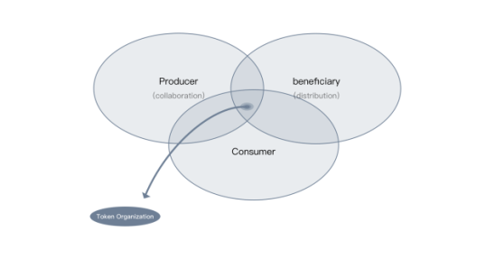

图：通证组织

Figure: Token Organization

3.2 通证组织应用场景举例

Examples for Token Organization Application Scenarios

   有一群热爱区块链技术，渴望把未来变为现实的人，他们通过不同渠道来到了一个要经过答题筛选才可以进入相应圈子的区块链社群平台。

There are a group of people who love blockchain technology and are eager to turn the vision of the future into reality. They come to a blockchain community platform through different channels that have to go through the answer screen to enter the corresponding circle.

   在这个平台里，大家可以通过出题，答题和审题，公平地获取token，同时因为平台自动记录了大家参与问答环节的参数，而给每个成员阶段性地颁发一个含有个人知识结构标识的身份通证。

In this platform, everyone can obtain tokens reasonably by presenting, answering, and reviewing questions. At the same time, because the platform automatically records the parameters of everyone participating in the Q&A part. At different phase, each member will get an identify token which correspond with a personal knowledge characteristic.

   有一天，社群成员小Q看到一本很精彩的英文版区块链书籍，但他觉得对于英文有障碍的区块链学习者，这本无疑是一本天书。此时，他看到了这个商业机会，将书籍翻译成中文，再通过内容分发平台出售中文电子版权的方式获利，所得收益由团队参与者共同分享。于是，他就在平台上面发布了如下的智能合约：

One day, community member Little-Q discovers a valuable in English blockchain book; he sees this business opportunity to spread this knowledge to Chinese readers. Translate books into Chinese, and then profit from the sale of Chinese electronic copyright through the content distribution platform. Team participants will share the proceeds. So he posts the following smart contract on the platform:

Smart Contract

{

任务：翻译英文版《区块链改变世界》并在区块链内容分发平台出版

Mission: Translate《Blockchain Change the World》and publish on blockchain content distribution platform

Requirement:

翻译10人，校对2人，绘图2人，编辑1人

Translator ten people, proofread two people, illustrator two people, edit one people

周期:一个月

Duration: 1 month

收益:中文版分发收益

Profit: Chinese copyright publish income

分配:所有人员按提交的工作量进行分配

Allocation: All members are distributed according to the work submitted

翻译组60%，校对组10%，绘图组10%，编辑组10%，发起人10%

Translation group 60%, proofreading group 10%, illustrator group 10%, edit group 10%, initiator 10%

定金:每人抵押预计收益的50％

Deposit: All members need deposit 50% of the estimated profit

责任:成员必须按时按量完成，否则抵押部分按比例分配给其他成员。

Responsibility: Members must complete the task on schedule; otherwise the deposit will be distributed to other members in proportion.

}

   由于在区块链的广播，持有合乎条件的身份通证的成员可以看到这条消息。大家可以根据自己的时间安排，选择性加入这个合约，承担起特定的任务。

Because of the blockchain broadcast, members who hold a qualified identity token can see this message. Everyone can choose to join this contract according to their schedule and take on specific tasks.

   这些成员的身份均经过平台认证，且他们的身份通证含有在平台上的贡献度、成绩表、人际关系及其他能力参数。经过发起人的筛选 ，选择了24个成员进入项目组承担不同的任务。

The identities of these members have been verified by the platform, and their identity token contains the degree of contribution, performance table, social relationship and other capability parameters on the platform. After the initiator’s screening, 24 members are selected to enter this project team to undertake different tasks.

   经过这个项目组一个月的努力，此书的中文电子版正式推出 。经投票，项目组决定把翻译完成的书籍上传到某个致力于内容版权分享获益的区块链平台。此时，由于翻译任务完成并且成果已经发布，以后所得收益由智能合约自动 执行，翻译项目组即宣布解散，项目组成员可以去平台的DAPP里寻找其他感兴趣的项目。

After one month's hard work of this project team, the Chinese version of this book is officially launched. After the voting, the team decides to upload the Chinese book to a blockchain platform which is dedicated to sharing content copyright and getting the benefit. At this point, as the translation task is completed and the results have been published, the future proceeds will be automatically executed by smart contracts. The translation project team is announced to be dissolved. The project members can go to the platform's DAPP to find other exciting projects.

   随着这个内容版权平台的读者对该本书籍的订阅量持续增加，项目组的统一账户也持续得到了版权的收益。这一版权收益随即激发当时发起翻译项目时的智能合约，并且根据固定比例进行token的兑换，最终，项目发起平台将收取一定手续费后，持续给予每个人应得的报酬。

As the subscription of the book continues to increase on this content copyright platform, the unified account of the project team will continue to receive the profits of copyright. This copyright profit triggers the smart contract immediately which deployed at the time of initiating the translation project, and the token will be exchanged according to a fixed proportion. Eventually, the project initiating platform will continue to give everyone a due remuneration after deducting a specific fee.

   理论上，只要该内容版权平台永久存在，而且该书籍有新的读者阅读并完成付费，此项目组的所有成员，将永久持续产生收益！而项目发起平台也得到了源源不断的手续费用。

In theory, as long as the content copyright platform persists, and new subscribers of the book and complete the payment, all members of the project team will continue to receive revenue forever! The project initiating platform also received a continuous profit.

   整个过程中，没有任何账务纠纷，因为所有的规则都预先写入智能合约，而智能合约不可篡改且自动执行。在收到版权平台的收益后，项目发起平台将自动执行智能合约，将收益按项目成立初期约定的比例分发给参与者。协作的过程中，通过智能合约，将人员的精力从人际关系与财务纠纷中抽离出来，每个人的关注点都集中在工作上，以提高工作效率。

There are no financial disputes throughout the entire process because all rules are pre-defined on the smart contracts which are immutable and executed automatically. After receiving the profits of the copyright platform, the project initiating platform will automatically execute the smart contract and distribution of benefits to participants in proportions agreed at the beginning of the project. In the process of collaboration, the energy of personnel is saved from interpersonal relations and financial disputes through smart contracts. Everyone just needs to focus on job so as to gain more efficiency.

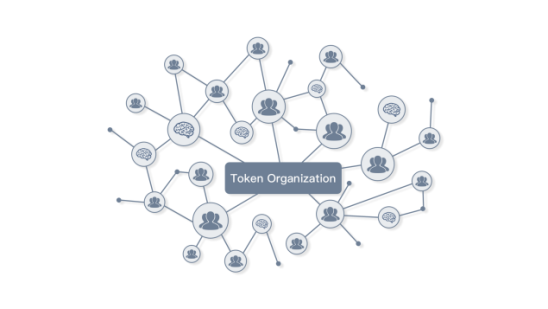

图：通证经济关系

Figure: Token economy relationship

3.3 致敬未来

Salute to the Future

   看完《原则》，《失控》，《科技想要什么》，《未来简史》，《区块链革命》，《区块链量子财富观》等书籍，我们洞见未来，认为未来公司形态将被通证组织替代。人们相互之间由于产生社区共识、相信数学算法而变得极度透明，更加紧密合作，从而为共同的目标而做出努力。

After reading *Principles, Out of Control, What Technology Wants, A Brief History of Tomorrow, Blockchain Revolution,* *Blockchain Quantum Wealth,* and other books, we have insight into the future and believe that the token organization will replace the corporation in the future. People become incredibly transparent and collaborate more closely, because of the community consensus and belief in mathematical algorithms which is generated among people, thereby making efforts for common goals.

   未来的人类早已解决了温饱问题，体力劳动被机器人替代，一些脑力劳动也将被人工智能替代。每个人富余的时间将越来越多，创意、艺术、哲学将大放光彩。有人无所事事，成为无用阶层;有人重新寻找人生的意义，通过社群来组织新的生产关系。社群里每一个人为共同的愿景而自我驱动，大家追求有意义的工作，有意义的人际关系，价值之网也随着区块链技术得到重构。

Humanity has already solved the problem of food and clothing in the future. Manual labor is replaced by robots, and some mental work will be replaced by artificial intelligence. Everyone will have more and sparer time, and creativity, art, and philosophy will shine. Someone has nothing to do and forms to a useless class; someone re-seeks the meaning of life and organizes new relations of production through the community. Everyone in the community is self-driven for a common vision. Everyone seeks meaningful work, meaningful relationships, and a network of values is reconstructed with blockchain technology.

   基于区块链技术的通证组织，将最大程度利用激励机制，释放强大的生产力，创造力！区块链让我们有条件相信算法信用，使社群成员之间合作的得到去中心化的可信保证。由于算法信用体系的完善，分布式协作有了价值网络的支撑，此时，跨地域跨时区的协作效率将会以倍数增长。可以展望，未来在通证组织下产生的生产关系将被颠覆，社群成为了新经济体协作的基石，社群地位越来越重要，我们深信“得社群者得天下”！

Based on the blockchain technology, through the fulfilling the incentive mechanism by a token organization, it will come up the powerful productivity and creativity. The blockchain allows us to conditionally trust algorithm credits so that decentralized credit can guarantee the collaboration between community members. Due to the improvement of the credit system of the algorithm, distributed collaboration has been supported by the value network. At this time, the efficiency of collaboration across geographies & time zones will increase in multiple times. It can be forecasted that in the future, the production relations generated by the token organization will be subverted, the community will become the cornerstone of the collaboration of the new economy, and the status of the community will become more and more important. We are convinced that “Only those who have the community could get their reign”!

   目前，很多协作关系还是受制于人与人之间的信任，价值观也是多元化的。但随着智能合约的应用高度发展，以后将在大量协作的新经济体里呈现普适化。所以，我们应当活在未来，先行一步，利用区块链技术将信用、人脉、知识上链，让这些在物理世界无法衡量价值的无形资产成为可信源，在链上确权，从而降低新经济体内部和外部的交易成本，提高协作效率。

At present, many collaborative relationships are subject to the interpersonal trust, and values are also diverse. However, as the application of smart contracts is highly developed, it will be universalized in the new economy which is full of collaboration. Therefore, we should live in the future, stay one step ahead, and use blockchain technology to make the credit, social relationship, and knowledge on the chain. Therefore, these intangible assets that cannot be measured in the physical world become a trusted source, and the data ownership is verified on the chain, thus reducing the transaction costs inside and outside the new economy, improving the efficiency of collaboration.

   根据梅特卡夫(Metcalfe)法则，网络价值以用户数量的平方的速度增长，而在区块链为基础的比特世界，这一定律显得更加重要。前期我们将大力发展用户，全力打造币须达摩的活跃度，使币须达摩形成真正的平台，从而产生放大效应，实现从量变到质变。

According to Metcalfe's law, the value of a telecommunications network is proportional to the square of the number of connected users of the system, and in the blockchain-based bit world, this law is even more critical. In the early stage, we will develop users vigorously and make every effort to build the vitality of Coinzen, to make it form a real platform, thereby it will cause amplifying effect and realize from quantitative change to qualitative change.

   从信息互联网到价值互联网的时代已经到来，一切才刚刚开始。带有有效激励机制的通证将会在社群内部首先被应用起来，同时，这个通证将会锁定社群共识。随着使用通证的人数逐渐增加，它将越来越有价值。

The time has come, from the information Internet to the value Internet. Everything Is Just Beginning. A token with incentive mechanism will be applied firstly in the community. At the same time, this token will be regarded as community consensus. As the number of token users increases, it will become more and more valuable.

   我们早已意识到通证组织与之前物理世界的组织的有本质上的区别。现今世界的组织基本是中心化的，人员之间很多精力都消耗在人事、财务、利益等各种纠纷与斗争当中，通过智能合约的不可篡改及自动执行的特性，将人员的很多精力从无谓的内耗中解脱出来，提高了生产力，并最终改变生产关系。作为通证组织早期推动者，我们将打造一个比特世界超级社群，让社群成员利用涌现机制推动新经济组织的自我完善与进步。社群育成之后，币须达摩团队将逐步放弃主导权，让更有创造力的社群成员接棒。因此，从一开始就设计好的通证激励机制，将会让社群里的每一个人成为权益相关者，从而推动社群生态健康有序发展。

We have realized that there is a fundamental difference between the token organization and the previous physical world organization long ago. The modern organizations in the world are centralized. A lot of energy in the interpersonal relationship is wasted in various disputes and struggles such as personnel, finances, and interests. Through the features of smart contracts that is immutable and automatically executed, it can extricate these energies from the internal consumption, to increase productivity, and ultimately changes production relations. As an early promoter of the token organization, we will create a super community in the bit world, and make the community members use the emergence mechanism to promote the self-improvement and progress of the new economic organization. After the community is incubated, the Coinzen team will gradually give up its dominance and allow more creative community members to take over. Therefore, from the very beginning, a well-designed token incentive mechanism will enable everyone in the community to become stakeholders, thereby promote the development of the community ecosystem healthy and orderly.

​    尼采宣称上帝已死超过一个世纪，暗示着人类必须改变哲学思想以适应发展。人类从相信人文主义，转变到相信算法主义，是一个颠覆性的变革。这必然导致在一段时期，人类社会将遭受某种失控。如出租车司机将步工业革命时期的马匹的后尘，被更先进的自动驾驶汽车所淘汰，也会有更加智能的算法机器人取代白领的工作。一旦拥有高度智能而本身没有意识的算法接手几乎一切工作，而且能比有意识的人类做得更好时，无用阶层将大量产生。

Nietzsche has claimed that God is dead since more than a century ago, implying that human beings have to change their philosophical thinking to adapt to development. It is a subversive change that the human beings change from believing in humanism to believing in algorithmism. It will inevitably lead to a specified period when human society will suffer from some kinds of out of control. For example, taxi drivers will follow in the footsteps of the horses during the Industrial Revolution and will be eliminated by more advanced self-driving vehicles. There will also be more intelligent algorithmic robots to replace white-collar jobs. Once a highly intelligent and unconscious algorithm takes over almost everything and can do better than conscious humans, the useless class will proliferate.

   人类还能做什么？只要结果有效，算法是以碳为载体还是以硅为载体又有何差别？科技体有自己的发展方向，不是我们可以控制的，也许，这时候，智人真到了可以完全退休的时候了。

What else can humans do? As long as the results are valid, what is the difference between the algorithm using carbon carrier or silicon carrier? The science and technology has its direction of development. It is out of our control. Maybe it is time for Homo sapiens to retire altogether.

   但币须达摩这一款社群育成游戏平台，将人们团结在一个虚拟社群里，居安思危，以极度求真，极度透明为原则，通过大规模协作，共同挑战通过算法打造的人工智能阿尔法魔，转战意识的海洋，在心智与创意领域找到自己的位置。

However, Coinzen is a community- incubated game platform that unites people in a virtual community. People in the community stick to the principle of the pursuit of truth and transparency. Through large-scale collaboration, community members jointly challenge the artificial intelligence Alpha Monster created by the algorithm, and eventually, they'll be able to find the meanings of human beings in the field of the consciousness and creativity.

   人工智能是生产力，区块链是生产关系。新经济体属于科技人文主义还是数据主义？让我们一起在币须达摩里探索，一起逃逸二向箔！

Artificial intelligence is the productivity of the next generation, while blockchain is the production relationships. Does the new economy belong to scientific and technological humanism or dataism? Let's explore together in Coinzen, and escape from the Two-Dimensional Foil!

 

3.4 币须达摩由来

Origin of Coinzen

币须达摩的概念来自区块链研习社达摩院与币须说在线协作团队，币须达摩总结了区块链研习社的整个社群生态育成的系统方法，通过知识型互动游戏进阶筛选的方式，结合区块链、智能合约的新型协作技术，结合外部资源，最终打造成一个面向未来的区块链社群育成游戏平台。所有的区块链爱好者，都能在社群的协作关系中找到自己的核心特长，打造自己的负熵内核，展现最真实的自己，找到有意义的人际关系，提高协作能力，迸发创造力，最终收获到精神与物质的财富。

The concept of Coinzen comes from the Dharma House and Tokentalk online collaboration teams both derived from the Chainclub. Coinzen inherits the whole systematic approach of the Chainclub. Through advanced screening of knowledge-based interactive games, combined with the new collaboration technology of blockchain and smart contracts as well as external resources, Coinzen will eventually create a future-oriented blockchain community incubated game platform. All blockchain enthusiasts can find their core specialty in the collaborative relationship of the community, develop their negative entropy kernel, show the truest of themselves, find meaningful interpersonal relationships, improve collaboration capabilities, and inspire creativity, gain spiritual and material wealth finally.

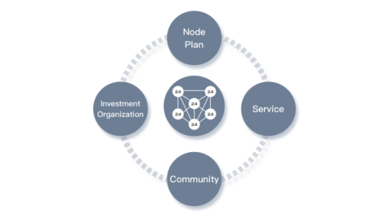

图：达摩院育成生态

Figure: Coinzen Academy incubating ecosystem

 

1. **项目详述**

**Project Specification**

4.1 项目概述

Project Summary

   币须达摩是一款终身学习型区块链社群育成平台，是世界上第一款社群游戏化，游戏现实化的社群类育成平台，在区块链技术兴起的今天，育成区块链社群显得特别具有划时代的意义。  

Coinzen is a lifelong learning blockchain community incubated platform. It is the world's first community-based gamification and game-based realization platform for incubating communities. Today, in the rise of blockchain technology, it is particularly epoch-making to incubate a blockchain community.

   币须达摩里最有价值的知识身份token，身份卡牌，利用了区块链技术限量发行卡牌原理，与加密猫一样，可以转让、交易。玩家能在海量的知识问答等游戏中收获达摩币（damo币），通过完成答题任务，完成项目方任务等关卡，逐渐从小白身份升级到达摩身份，同时拥有不同身份的不同社群权限。

Coinzen has the most valuable knowledge identity tokens—identity cards. It utilizes the principle of blockchain technology limited edition cards, like crypto kitty, which allows cards to be transferred and traded. Players can collect damo coins by answering massive knowledge quiz games. Through accomplishment of the tasks, the users can gradually upgrade from newbie to Coinzener, meanwhile get different community identities from different privileges.

   在合成身份卡牌时，玩家将燃烧达摩币（damo币），通过激发智能合约，让蕴含着知识、人脉、资源认证数据的身份卡牌登上公信宝的主链，并通过分布式存储，上链操作，让这些数字资产都成为自己的专属可控数据资产。

When synthesizing identity cards, players will burn damo to activate the smart contract in order to upload all the information stored in the identity card onto GXChain. These including knowledge, social relationships, and resources. Through distributed storage system, on-chain operation, all these information will become reliable digital assets that exclusively owned by the data producers. 

   最终，进入达摩院的社群成员可通过平台发起带有智能合约的项目任务，组建团队，线上协作以及完成项目，最终创造价值。

Besides, community members who joined Coinzen Academy can initiate tasks with smart contracts, build teams, collaborate and manage projects online, eventually create value for the whole community.

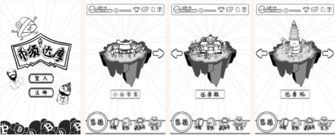

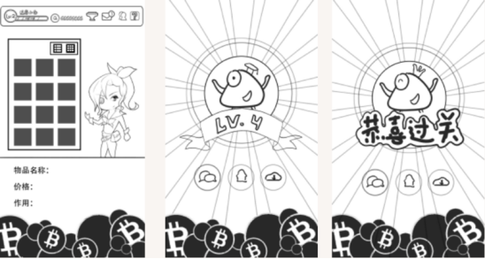

图：币须达摩游戏界面原画

Figure: Original paintings of Coinzen game interface

4.2. 项目模块介绍

Projects Modules 

4.2.1 藏经阁

Coinzen Library

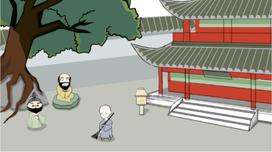

图：藏经阁原画

Figure: Original paintings of Coinzen Library

  藏经阁是一个去中心化区块链知识题库，题目全为选择题。角色分为出题者（面壁者）与审题者（破壁人）。在这个关卡将产生一个智能出题机器人“阿尔法魔”，所有出题者和审题者均可在题库系统作出贡献，在藏经阁打造个性化的阿尔法魔，并在小白学堂通过挑战阿尔法魔获得奖励和荣耀。

Coinzen library is a decentralized blockchain knowledge question bank containing hundreds of thousands multiple-choice questions. Each player can choose to participate as a question presenter (Wallfacer) or reviewer (Wallbreaker). The presenters and reviewers work to feed personalized intelligent robots "Alpha Monster" generated by the system. Continuous infusion of question bank will provide support to Coinzen 101, which is a question-and-answer game for new users. Participants can challenge Alpha Monster in Coinzen 101. Every time an Alpha Monster is defeated, participants can get the rewards and honor.

   藏经阁将把题目进行标签分类，以区块链题目为起点，涉及到现有各学科知识，答题者回答的题目越多，在身份通证反映的知识结构标签就越准确。

Coinzen library will create classification groups and set up tags for each question. In the early stage, most questions will be based on blockchain knowledge. Then, the question bank will expand to other subjects and aim to cover a more comprehensive and diversified knowledge spectrum. The more questions a participant answers, the more accurate tag could be constructed on the identity token.

 

图：阿尔法魔原画

Figure: Original painting of Alpha Monster

4.2.2 小白学堂

Coinzen 101

   经过藏经阁审核出来的选择题将直接导入小白学堂。小白可以在里面通过与阿尔法魔的PK，得到积分，得到成绩，最终消耗damo合成上区块链的知识身份通证－达人牌，得到进入达人馆的资格。

Question bank generated from Coinzen library will be used in “Coinzen 101 ". By challenging Alpha Monster，each participants can earn points. Points can be redeemed instantly for damo, and damo holders can consume their tokens to synthesize a knowledge identity token that upload on blockchain—Talent card, which gives the players the permission to Talent hall.

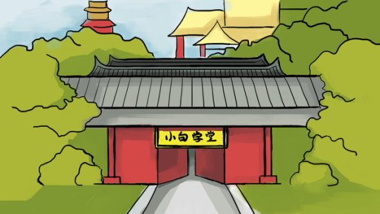

图：小白学堂

Figure: Coinzen 101

4.2.3 达人馆

Talent Hall

   获得达人身份的玩家可以进入达人馆与项目方以及大咖进行深度沟通。每个达人馆限定500个名额，额满即止，旨在维持熟悉度和黏度。每个达人可锁定规定数量的达人馆进入，锁定的特定馆标将在身份通证上有所显示。每个达人馆均设有辨经台，可以进行辨论，在辩论赛中，限定时间内，获得最多支持者的即可胜出，胜出者与支持者均可瓜分奖励。达人可以去旁观锁定之外的达人馆的内容。但在非锁定的达人馆不能参与辩论，要感兴趣，得要把内容发到自己的馆上进行辩论。达人可以通过消耗damo合成知识token－达摩牌，让辩论成绩上链，并得到进入达摩院资格。

Once the players get permits to join Talent hall, they become talents. Talents can reach token issuers and KOLs for in-depth communication. There are only 500 permits available for each Talent hall on a first-come-first-served basis. The permit policy aims to maintain a strong-tie social network within this community better. Talents can join limited amounts of Talent halls that the halls' tag will be labeled on the Identity Token. In each Talent hall, there is also a debate stage, where people are free to sign up for debate. The one who gains most supporters within the time limit will win the debate, and both the winner and his/her supporters can share the rewards. Talents can also choose to watch other Talent Halls' debates, but are not allowed to participate in. Talents can consume damo to create a knowledge token - Coinzen card and put the debate result on the chain to get permits to join Coinzen Academy.

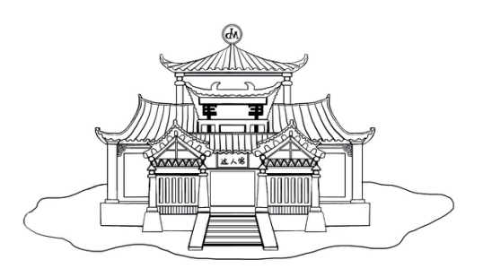

图：达人馆

Figure: Talent hall

4.2.4 达摩院

Coinzen Academy

   获得达摩身份的玩家，可进入达摩院，每个达摩院每个小组限定最高24人。达摩院按知识分类，或按项目分类。如人工智能001院，密码朋克010院，游戏开发011院等。在达摩院里，达摩们穿越结构洞的能力更强，达摩可以发布任务，发布需求，迅速组成项目协作小组，并产生真正的项目服务交易。达摩院将成为线上区块链项目孵化的神器。所有在线上完成服务交易的项目，将项目名称以及团队成员以及交易金额上链，永久记录。

Once the players get permits to join Coinzen Academy, they become a Coinzener. Each collaboration team in the Coinzen Academy is limited to 24 persons. Coinzen Academy is composed of several labs categorized by knowledge types, or by projects. For example, there could be an AI 001 lab, a Crypto-punk 010 lab, or a game development 011 lab. In Coinzen Academy, Coinzeners are equipped with better ability to cross the structural hole. Coinzeners can at his/her discretionary publish a bounty program to recruits various talents to work with him/her. Coinzen Academy will evolve itself into an online incubator that incubates blockchain startup projects. Every piece of information about each project will be confirmed on chain, and once approved, it's forever. 

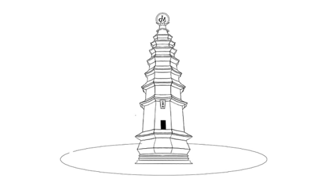

图：达摩院

Figure: Coinzen Academy

4.2.5 达摩集市

Coinzen Marketplace

   玩家可在达摩集市交易道具，购买道具，以及拍卖身份卡。

Players can trade props (C2C), buy props (B2C), and auction their ID cards in the Coinzen marketplace.

1. **商业模式**

**Business Model**

\5. 1 达摩市集－交易道具

Coinzen Marketplace- Props Trading

   币须达摩游戏里，将设有一个集道具交易和otc交易的达摩集市。达摩集市作为玩家自由交易达摩牌和其他数字资产兑换damo的平台而存在。在达摩集市里的通证是damo，交易产生的手续费用均以damo结算。因此平台将在此环节回收damo。

Coinzen marketplace acts as a trading platform that players can trade Coinzen cards or buy damo with other digital assets. The legitimate token in the Coinzen marketplace is damo, and fees incurred will all be settled in damo as well. Coinzen will then burn these settled damo.

\5. 2 合成身份－燃烧damo

Synthesize Identity – Burn damo

   在合成基于ERC721开发的身份牌时，玩家需要燃烧damo，也就是说此部分的damo将直接打到0地址燃烧掉，没有人有私钥可以找回， 从而可以确保damo越来少，越来越珍贵，身份牌也随之升值。

In synthesizing an identity card which is based on ERC721, players need to burb damo. The burnt damo will be transferred to the address zero, and no one possesses the private key.

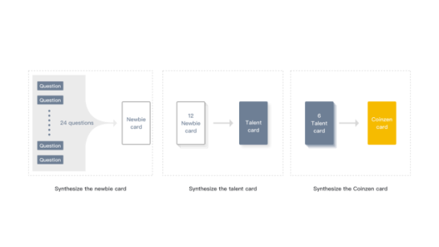

图：身份通证合成示意

Figure: Demonstration on how to synthesize an identity token

5.3 达摩院API－toB收费

Coinzen Academy API - toB Model

   通过付费接口让区块链项目方直接进驻超级达摩院，用这套社群工具通过分布式协作的方式管理他们的粉丝，不断提升粉丝对项目的认知，生成项目自己的各种协作小组。同时让项目方给予他们的项目认证，认证完成的数据上链，精准提高粉丝等级。

Coinzen Academy provides charged API for blockchain project owners. Blockchain project owners can use this API to manage their fans and community members, so as to promulgate the platform, and encouraging the users to initiate their co-working projects. At the same time, the Coinzen master who initiates the project can certify the project members. The project certification data will be on the chain, it will accurately increase the fan rating.

5.4 交易所交易－金融增值

Exchange Trade - Financial Growth

   在一个按玩家贡献发放，也因满足玩家需求而提供服务，并有燃烧机制的循环系统里，damo将越来越有价值。自由交易的币须达摩集市将为damo进行去中心化的赋值。因此，可以展望，在未来damo登陆交易所，会迎来无限的生机！

In a circulation system that is distributed based on player contribution, it will not only provide services meeting player demand, but also will accompany with recycle mechanism. The damo will become more and more valuable. The freely traded damo will be decentralized assigned by the Coinzen marketplace.

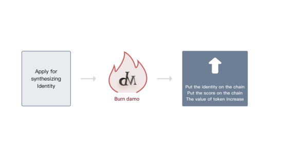

图：合成身份通证

Figure: Synthesize identity token

1. **角色以及权益**

**Characteristics and Corresponding Rights**

6.1 比特世界创世者

Bit World Genesis Users

   第一轮发9999个邀请码，成为创世用户，拥有创世者标签，获得创世特权。每位创世者一开始将得到邀请码，可以邀请 8个小白成为自己的追随者，创世者有指导追随者进步的义务，以后这些追随者通过答题游戏得到damo，同时将会提成给创世者10％，创世者必须先找到自己的负熵内核，然后不断强化，邀请具有共同愿景的人加入。

We will send out 9999 invitation codes during the first round. The first 9999 users accompany with Genesis Tag.  After he(She) sign up with the invitation codes. He(She)  will become Genesis User, and will have exclusive privileges. Every Genesis User can invite up to 8 newbies to sign up as their followers. They are supposed to act as mentors to guide their followers. Every time the followers earn damo by participating in Coinzen 101，Genesis Users can acquire 10% of those earning points. A Genesis User must find his/her negative entropy kernel, keep reinforcing and invite people who share the same vision.

6.2 比特世界达人

Bit World Talent 

   创世者或追随者升级为达人，具有达人标签，可多邀请小白至16个追随者，以后的达人追随者通过答题游戏得到damo，同时将提成给创世者10％，当自己的追随者升级为达人越多，那么穿越结构洞的能力稍强

Whenever Genesis Users or followers upgrade to Talents, a Talent tag will be associated with him(her).  After that, a Talent can each invite up to 16 followers. Furthermore, they can also acquire the bonus points from the followers of their followers who have become Talent. The more followers who have upgraded to Talents, the stronger the ability of the Genesis User to cross the structural holes.

6.3 比特世界达摩

Bit World Coinzener

   升级为达摩，可邀请小白至24个追随者，以后达人在辩经台通过问答辨论赚到的damo，自动提成给达摩10％，当自己的追随者升级为达摩越多，那么穿越结构洞的能力更强。

Whenever Talent upgrade to Coinzener, they can each invite up to 24 followers. Coinzener can also acquire the 10% rewards from their followers. The more followers who have upgraded to Coinzener, the stronger the ability of the Genesis User to cross the structural holes.

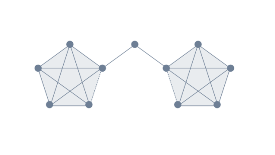

图：结构洞

Figure: Structural Holes

1. **技术实现** 

**Technological Realization and Application**

​     币须达摩选择了公信链（GXChain）作为整个应用的技术底层。公信链是以Graphene为底层技术，拥有高性能、可扩展性强等优点的公有链，理论上每秒能处理10万笔交易。

Coinzen selects GXChain as the underlying technology for the entire application. The GXChain is based on Graphene as the underlying technology. It has a high-performance, highly scalable public blockchain, and can handle 100,000 transactions per second theoretically.

7.1系统框架

System Framework

   币须达摩选择了公信链（GXChain）作为整个应用的技术底层。公信链是以Graphene为底层技术，拥有高性能、可扩展性强等优点的公有链，理论上每秒能处理10万笔交易。

Coinzen selects GXChain as the underlying technology for the entire application. The GXChain is based on Graphene as the underlying technology. It has a high-performance, highly scalable public blockchain, and can handle 100,000 transactions per second theoretically.

7.1系统框架

System Framework

7.1.1 基于公信链的分布式存储

Distributed Storage base on GXChain

   传统的中心化服务器，经常会发生黑客攻击数据库，导致系统瘫痪或是个人数据泄露的恶性事件。为了保证存储数据的安全性和可靠性，币须达摩接入了公信链的BaaS作为存储方案。

For a traditional centralized server, the database are often attacked by hackers, causing vicious incidents such as system failures or the leakage of personal data. To ensure the security and reliability of stored data, Coinzen adopt  BaaS from the GXChain as a storage solution.

   区块链即服务（BaaS），是指利用区块链产生的数据，提供基于区块链的搜索查询、任务提交，等一系列操作服务，解决现有应用无法解决的各类痛点。

Blockchain-as-a-Service (BaaS) means using of blockchain-generated data to provide search queries, task submissions, and a series of operational services within blockchain  to solve various types of pain points that cannot be conquered by existing applications.

   在公信链上，BaaS作为侧链扩容的方式为开发者提供以下服务：数据上链存储和结果查证。将数据本体存储在IPFS上，数据的哈希地址和文件的标识信息会在公信链主链上进行存证，通过数据私钥保证数据支配权归于用户。

On the GXChain, BaaS provides developers with the following services as a sidechain expansion method: data storage on the chain and verification of results. The data content is stored and certified on the IPFS. The hash address of the data and the identification information of the file are preserved on the main chain of GXChain. The data private key guarantees that the data control power belongs to the user. 

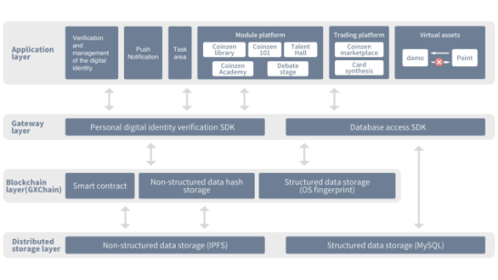

图：系统架构

Figure: System Framework

7.1.2 分布式存储

Distributed Storage

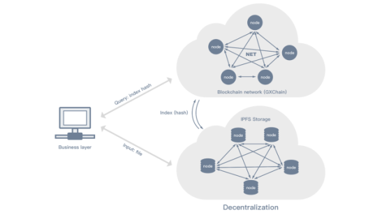

图：分布式储存

Figure: Distributed Storage

 

IPFS存储去中心方案

IPFS storage plan

   存储：业务层将文件资料经过“IPFS存储”处理后，文件将得到一个新的名字：“文件内容哈希”（即“索引hash”），同时文件入库后，会以分片的形式存到不同的节点上。

Storage: Business layer processes the documents by using the IPFS storage system. After being processed, the file will be assigned a new name: " file content hash" (aka. index hash). In the meantime, the files stored in the databases will be saved on various nodes using sharding strategy.

   存证：区块链层（GXChain）存储来自“IPFS存储”处理后的索引hash和相关信息（如操作者、操作时间等信息）。

Preservation and evidence: The blockchain layer (GXChain) stores index hash and other related information (such as operator, operation time) that has been processed by IPFS

   读取：调用BaaS服务方的API接口，可根据GXChain中的哈希值进行寻址查询文件相关信息，并可提取IPFS中的对应文件。

Read: Call a BaaS API from the blockchain layer (GXChain) to query a file by its hash value, and extract the file.

   节点：文件以分片的形式存储到不同的节点上，文件被其他节点访问的越多，副本就越多，只要有部分节点在线就可提取文件。

Nodes: Files are stored on different nodes by sharding. The more one file is accessed, the more the nodes will store its copy during the whole system operation process so that it is more likely to be extracted even if there are only a part of nodes online.

   优势：采用分布式储存最新技术, 去除了中心化服务器(Server)节点,不用再受其管控，让每一个用户都真正拥有属于自己的数据。

Strength: Adopt the latest technology of distributed storage, the central server node is removed, and it is no longer under its control. The ownership of the data belongs to every user.

7.1.3 身份验证

Identity Verification

   使用币须达摩的各类应用，需要用户进行实名认证。币须达摩通过公信链为每个用户创建通用数字身份G-ID。G-ID是公信链生态内用户通用的身份标识证明。用户在币须达摩中的操作行为、获得的成就都会与G-ID关联，如用户发生作弊行为，都会作为负面信息记录，大大提高用户的作弊成本。

The use of Coinzen various applications requires users to carry out real-name authentication. Coinzen creates a universal digital identity, called G-ID for each user through the GXChain. G-ID is a standard user identity certificate in the GXChain ecosystem. The operation behavior and achievement of the user in the Coinzen will be associated with the G-ID. If the user commits cheating, it will be recorded as negative information and significantly increase the user's cheating costs.

7.1.4 价值数据的交易

Valuable Data Transaction

   币须达摩将对系统中所有的数据进行去中心化处理，并且为用户产生价值传递闭环。

Coinzen processes all data in the system with IPFS technology, and it can propagate value within the closed loop node. 

   正如卡莫斯.莫雷拉说的那样——“现在，身份是你的，但你的身份在世界中活动所产生的数据却是别人的”。在大多数公司和机构眼中，你就是一堆数据，这些数据来自互联网中的踪迹。它们收集你的数据并将其变成一个“虚拟的你”，并通过这个虚拟的身份给你提供很多难以想像的便利。不过，这样的便利是要付出代价的，那就是隐私权，我们并不赞同那种“隐私权已经没有希望了”的思想。隐私权是自由社会的基石。

Carmos Moreira indicates that though your identity is yours, but the data generated by your identity on the internet belong to someone else. Internet companies regard you as just a bunch of data. They keep track of your behaviors on the internet. Through collecting your behavioral data, they sketch out your virtual profile and provide targeted services to you. However, you eventually pay for the convenience by giving up your privacy. Our team is not quite a fan of those ideas that everyone should abandon their privacy; we intend to believe that privacy is the foundation of a free society.

   如果这个“虚拟的你”能被你掌管，那么世界会变成怎样？”

What if you can control the " virtual you"? 

这是你的个人化身，它由“生活”在你的身份所构成的黑盒子里。你可以从人与人的数据流中获得经济收益。当有人对你的数据进行访问时，你可以决定向对方公开特定的数据。你的个人化身能够管理和保护你的黑盒子里的内容。

It would be your avatar. It is composed of every piece of information in your life, but your information is well protected in a black box. You can even trade your behavioral data for money. When people attempt to visit your data, you can decide whether to disclose specific information to them. Your avatar will act as a guardian to manage and protect data in your black box. 

币须达摩可以让你根据具体情况，开放信息查看权限，让对方花费必需的damo，去获得你的数据信息。同时我们将妥善地处理你在网络活动中所产生的各种遗留信息，在保护你的隐私权的同时，进行价值数据的交易。

Coinzen allows you to set up different levels of access authority on your personal information. For individual information, you can set a price and charge on those who would like to acquire your data. In the meanwhile, we promise to secure the data during transaction.  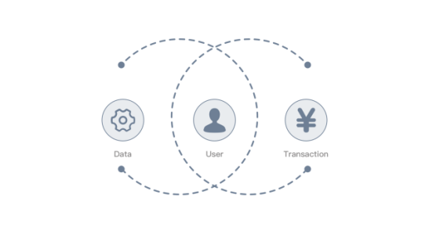

图：价值数据的交易

Figure: Valuable Data Transaction

7.1.5 用户画像

User Profile

  用户使用币须达摩的各类进阶游戏，会二次产生各类数据。这些数据上链后，会在用户的通用数字身份（G-ID）账户体系增加相应的身份标签。这些粗粒度身份标签能够侧面反应用户的行为。如藏经阁中出题游戏，喜欢出金融学知识的，分数最高的，可以获得金融专家的标签，喜欢出加密算法题的，初级水平的，可以获得密码学初学者标签。将用户的知识水平和行为习惯进行层级划分，精准提供给用户感兴趣的内容。用户的层级提升后，币须达摩会通过您的身份标签，以及所有体验过程的行为记录，并推荐加入通证组织的协作中去。

When playing various of Coinzen advanced games, users will generate various types of secondary data. After these data on the chain, the corresponding identity tags will be corresponded to the user's general digital identity (G-ID) account system. These coarse-grained identity tags can reflect the user's behavior. For example, in the presenter game of the Coinzen Library, a person who likes setting financial knowledge questions and has the highest score can get a label of a financial expert. If one would like to set encryption algorithm questions with entry level,  he can get a label of cryptography beginner. Coinzen will divide the user's knowledge level and behavioral habits into a different rating, and accurately provide content for users who are interested in. After the user's rank is upgraded, Coinzen will recommend users to join the collaboration of the token organization, according to the users' identity tag, as well as the users' behavior record of all the experiential processes.

7.1.6 数据交易服务（DES）

Data Exchange Service (DES)

   利用公信链提供的数据交易市场，用户有权选择以何种方式开发自己的数据，如未来加入达摩院的协作小组时，如有验证原始数据的需求时，其他用户需要通过DES提交数据交易的请求，并支付相应的damo币给数据所有者。数据所有者授权同意后，才可以完成整个数据查询、交易的流程。若数据所有者拒绝交易请求，数据交易将无法完成，DES保障了数据所有者完全支配自己数据的权益。

Using the data exchange market provided by the GXChain, users have the right to choose how to develop their data. For example, in the future when players join the collaboration team of Coinzen Academy, if there someone needs to verify the original data, they have to submit the data transaction through DES and pay the corresponding damo to the data owner. Only after the data owner has authorized, the entire data query and transaction process can be completed. If the data owner rejects the transaction request, the data transaction will not be achieved. DES guarantees that the data owner completely dominates the access rights of their data.

7.1.7 应用模块

Application Modules 

用智能合约实现分布式任务指派

Distributed task assignment with smart contracts

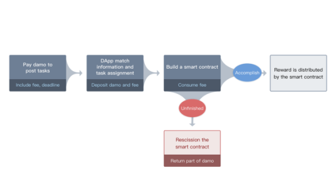 

图：任务指派流程

Figure: Task assigning process

用智能合约实现达摩集市

Coinzen marketplace with smart contracts

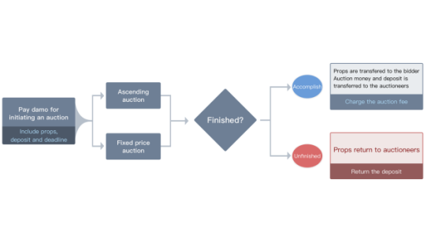

图：道具拍卖

Figure: Auction props

   A．递增拍卖：其形式是：在拍卖过程中，拍卖标的物的竞价按照竞价阶梯由低至高、依次递增，当到达拍卖截止时间时，出价最高者成为竞买的赢家（即由竞买人变成买受人）。

A. Ascending auction mode: Auctioneer announces an opening bid and the price increases incrementally over time. The highest bidder at any given moment is considered to have the standing bid, and when the auction ends, the standing bid becomes the winner. 

   B.一口价拍卖：卖家以固定价格出售商品，买家可以立刻买下自己想要的商品，以最快的速度完成购买过程。

B. Fixed Price mode: Sellers sell the merchandise by putting a price tag which allows buyers to make the transaction as quickly as possible.

   币须达摩平台将向市场上进行的每笔交易收取一小部分费用。

Coinzen platform will charge a service fee on every transaction in the marketplace.

7.2 底层技术介绍

Underlying technology

7.2.1  智能合约

Smart Contract 

   智能合约是一种旨在以信息化方式传播、验证或执行合同的计算机协议。智能合约允许在没有第三方的情况下进行可信交易，这些交易可追踪且不可逆转。智能合约概念于1994年由NickSzabo首次提出。智能合同的目的是提供优于传统合同方法的安全，并减少与合同相关的其他交易成本。

A smart contract is a computer protocol intended to digitally facilitate, verify, or enforce the negotiation or performance of a contract. Smart contracts allow the performance of credible transactions without third parties. These transactions are trackable and irreversible. Nick Szabo first proposed smart contracts. Smart contracts aim to provide security that is superior to traditional contract law and to reduce other transaction costs associated with contracting.

 

7.2.2 不可替换通证协议

Non Fungible Token Protocol

   通常情况下，区块链上的代币是同质化的。每个代币的价值都是相同的，类似于现金的概念，你无须在意收到的是哪一个代币。非同质代表独一无二，加密猫为例，每只猫都被赋予拥有基因，是独一无二的，一只猫就是一个不可替换通证（Non Fungible Token，NFT），猫之间是不能置换的。这种独特性使得某些稀有猫具有收藏价值，也因此受到追捧。非同质性其实广泛存在于我们的生活中，如图书馆的每一本，宠物商店的每一只宠物，歌手所演唱的歌曲，花店里不同的花等等。目前基于非同质代币协议已经被广泛应用于区块链游戏上，如加密猫，加密城市。

Typically, tokens on blockchain are homogeneous. Each token represents the same amount of value. The concept is like cash because every dollar has equal value. Non-homogeneous tokens are one-of-a-kind. In the game "Cryptokitties", for example, every cat is born with unique genes. One cat is a Non Fungible Token (NFT). The unique characteristics made some cats born with rare genes become famous and have high collection value. Non-homogeneity is ubiquitous, such as every book in the library, every pet in the pet shop, every song, every flower in a flower shop. At present, non-homologous tokens have been widely used in blockchain games, such as encrypted cats and encrypted cities.

7.2.3 IPFS (Interplanetary File system) 协议

IPFS (Interplanetary File system) Protocol

​    IPFS本质上是一种内容可寻址、版本化、点对点超媒体的分布式存储、传输协议，目标是补充甚至取代过去20年里使用的超文本媒体传输协议（HTTP），希望构建更快、更安全、更自由的互联网时代。可以降低存储和带宽成本，为传统应用提供分布式缓存方案。

Interplanetary File System (IPFS) is necessarily a content-addressable, versioned, and peer-to-peer hypermedia distributed file system and transport protocol. The goal is to complement or even replace the hypertext media transport protocol (HTTP) used in the past 20 years, hoping to build a faster, safer, more free Internet era. It can reduce storage and bandwidth costs and provide a distributed cache solution for traditional applications.

   IPFS是一款安全可靠的文件分享工具，采用点对点（P2P）通讯方式构建分布式文件系统网络，能将文件内容以加密方式存储在分布式网络中，根据文件内容的哈希值进行寻址并提取文件，实现自由分享文件的同时充分保护用户的隐私。

IPFS is a secure and reliable file sharing tool that uses peer-to-peer (P2P) communication to build a network featured with distributed file system. It can store file content in a distributed network in an encrypted manner, then address it according to the hash value of the file content and extract it. Therefore, it can adequately protect users' privacy while freely sharing data.

   IPFS构建的分布式文件系统网络：当文件被添加到网络节点后，文件会分配到一个独一无二的名字，这个名字就是文件内容的哈希值（文件指纹，根据文件的内容进行创建），即使两个文件的内容只有一个字符不同，其哈希值也是不同的。所以IPFS是基于文件内容进行寻址，而不是像传统的HTTP协议一样基于域名寻址；每个节点除了存储自己需要的数据，还存储了一张哈希表，用来记录文件所在的位置，所以当查询某个文件时，IPFS会根据分布式哈希表和全网唯一的文件哈希值进行寻址就可以找到待提取文件；在整个系统运行过程中，文件被其它节点访问的越多，副本就越多，只要有部分节点在线即可提取文件。

Distributed file network system built by IPFS: If a new file is added to a network node, it will be assigned a unique "name" which is the hash value of the file content (file fingerprint, created according to the file content). Even if the contents of two files are only one character different, the files have different hash values. So IPFS is based on the file content to address, as compared with the traditional HTTP protocol which is from by domain name addressing. In addition to storing the raw data, each node will also save a hash table used to record the location of the file. When querying a file, IPFS will firstly address the hash value of it which is unique in the entire network and then extract the file. For a file, the more it is accessed, the more nodes will store its copy during the whole system operation process so that it is more likely to be extracted even if there are only a part of nodes online.

   另外，在我们的币须达摩系统中，整个网络范围内去掉了重复的文件, 并且为文件建立版本管理, 也就是说每一个文件的变更历史都将被记录，可以很容易回到文件的历史版本查看数据。

Also, duplicate files in the Coinzen system will be removed from the entire network and version management is performed for the files. It allows to record the history of changes to each file, and the file can return to every previous version to view data.

   币须达摩系统IPFS的存储空间没有上限，加入的节点越多，空间就越多，空间和加入的节点成正比。

There is no upper limit on the IPFS storage space of the Coinzen system. The storage size is directly proportional to the nodes added.

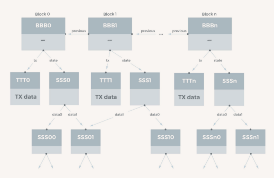

 图：基于默克尔树结构的分布式存储结构

Figure: The Architecture of Merkle tree structure based distributed storage

7.2.4身份验证技术

Identity Verification Technology

​    我们采用多种方式，综合使用基于区块链技术的第三方去中心化数字身份应用平台。

In order to perform the digital identity verification, we integrate with a variety of method coming from third-party, all of these methods are based on the blockchain.

   A．基于生物学特征的身份验证，基于每个人身体上独一无二的特征，如指纹，虹膜，声纹，脸部特征等，整合现有的生物特征身份识别服务。

A. Biometric identity - based authentication. It refers to the integration of existing biometric identity services based on the unique features of each person's body, such as fingerprints, irises, voiceprints, and facial features.

   B.基于公开密钥加密算法的身份验证，是指通信中的双方分别持有公开密钥和私有密钥，由其中的一方采用私有密钥对特定数据进行加密，而验证者采用公开密钥对数据进行解密，如果解密成功，系统认定用户合法，否则身份验证失败。

B. Public key encryption algorithm-based authentication. It means that one party in the communication hold the public key and the other one has the private key. The private key is used to encrypt the specific data, and the verifier uses the public key to decrypt the data. If the decryption is successful, the user will be considered legal. Otherwise, the authentication fails.

   C.基于社交网络的身份验证。社交网络(Social Networks，SN)或社交网络网站(Social Networks Site, SNS)是源于社会网络关系系统思想的网络应用形式，旨在帮助人们建立社会性的网络应用服务。社交认证是一种基于社交网络的新型认证方式。传统的安全系统主要通过三种方式实现用户认证：用户所知的，如密码；用户所拥有的，如硬件令牌卡；用户所是的，如用户指纹等生物特性。社交认证通过第四种方式，用户所认识的人，实现系统身份认证。

C. Social network-based authentication. The social network (SN) or social networks site (SNS) is web application service forms which originate from the idea of the social network relation system and aim to help people to establish a social network. Social authentication is a new type of authentication based on social networks. The traditional security system mainly implements user authentication in three ways: what the user knows, such as the password; what the user has, such as a hardware token card; what the user is, such as the user's fingerprint and other biological characteristics. Social authentication becomes the fourth method, which achieves the system authentication by who the user knows.

7.2.5 防刷题技术

Anti-brush Technique

   A.  相似度采用了“编辑距离”的对比方式，有的地方也称为Levenshtein距离，表示从一个字符串转化为另一个字符串所需要的最少编辑次数，这里的编辑是指将字符串中的一个字符替换成另一个字符，或者插入删除字符。

A. The similarity degree assessment adopts the “edit distance” (somewhere also called “the Levenshtein distance”) comparison method. The distance refers to the minimum number of edits (replace, insert or delete one character.) required to convert from one string to another. 

   B. 编辑距离的核心就是如何计算出一对字符串间的最小编辑次数，考虑到问题的特点，我们可以使用动态规划的思想来计算其最小编辑次数：两个字符串a=a1a2…an，b=b1b2…bm的编辑距离递归计算

How to calculate the minimum number of edits between a pair of strings is the core part of editing distance. According to the characteristics of the problem, we can use the idea of dynamic programming to calculate them. For instance, the recurrence calculation formula for two strings a=a1a2…an，b=b1b2…bm is shown following:

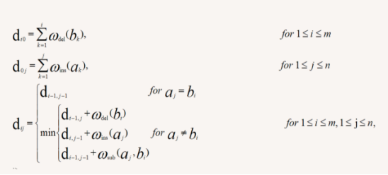

7.2.6 出题和审题奖励机制

Presenter and Reviewer Rewards

​      A.出题者在题被审核通过后，会随机获取到币奖励；

A. The presenter will receive a random token reward after his question is approved.

If( Pass )

​    Value = Random(min,max)

else

​    Value = 0 

​      B.审题者在题被审核出结果时，最终结果和审题结果相同，审题者获取奖励；

B. After the subject of the question is examined and the result is the same as the result of the review, the reviewer obtains a reward;

 If( Same )

​    Value = Random(min,max)

else

​    Value = 0 

7.2.7公信链特点

The Features of GXChain

1.高性能和可扩展性

High performance and scalability

   我们所采用的区块链技术是公信链，公信链是一条拥有高并发处理能力的公链，每3秒出一个块，拥有每秒高达10万笔交易的处理能力，考虑到今后链上业务不断上涨的可能性，公信链支持横向扩展，这样可以迅速扩张每秒交易处理能力，并不需要分叉来达到共识。

We adopt GXChain as blockchain technology. GXChain is a public blockchain with high concurrent processing capacity. It generates a block every 3 seconds and has a processing capability of up to 100,000 transactions per second. Considering the possibility of business growth on the chain in future, GXChain supports horizontal extending that can quickly expand transaction processing capacity per second and do not require the fork to reach the consensus.

2.参数动态调整

Dynamic adjustment of parameters

   公信链不需要分叉就可以修改系统参数，通过共识投票的方式实现区块大小、出块速度、手续费等全局参数的动态调整。

GXChain can modify system parameters without a fork, and realize the dynamic adjustment of global parameters such as block size, block generation rate, and handling fee through consensus voting.

   例如：目前每3秒出一个块，可以动态调整参数到每秒出块；目前区块大小是2M，可以动态调整成大区块，如8M。

For example, a block is generated every 3 seconds, and parameters can be dynamically adjusted to be produced per second. The current block size is 2 M, and it can be dynamically adjusted to a large block, such as 8M.

3.数据提供

Data supply

   在公信链上开发的去中心化数据交易所支持很多领域的数据交易和交换，企业和个人开发者可以交易获得和使用这些数据。

The decentralized data exchanges developed on GXChain supports data transactions and exchanges in many fields, and businesses and individual developers can buy and use these data.

4.BaaS服务

BaaS service

   公信链还提供一些如存储和验证类BaaS(区块链即服务：Blockchain as a Service)接口的支持，开发者根据丰富的BaaS-API、数据交易API、原生API开发出充满实际价值意义的区块链应用。

GXChain also provides some support such as the BaaS (Blockchain as a Service) interface for file storage and authentication. The developer can develop many real-valued blockchain applications based on the abundant BaaS-API, data transaction API, and native API.

5.基于公信链的应用开发

Application development based on GXChain

   与其他公共区块链相比，基于公信链开发的应用拥有各行业的数据支持，让开发者做出更有实际价值的商业应用。

Compared with other public blockchains, applications developed based on GXChains have data support from various industries, allowing developers to make more practical commercial applications.

6.数字资产发行

Digit Asset Issuing

   公信链上有数字资产的发行标准，允许开发者自由发行和流通应用。

The issuing standards for the digital asset on GXChain allow developers to issue and circulate applications freely.

7.代码开源

Open source code

   公信链以及相关代码已经在Github上完全开源。

   开源地址 <https://github.com/gxchain>

GXChain and related code have been completely open source on Github. (<https://github.com/gxchain>)

1. **通证经济架构**

**Token Economic Structure**

8.1．通证经济架构概述

Overview of the Token Economic Architecture

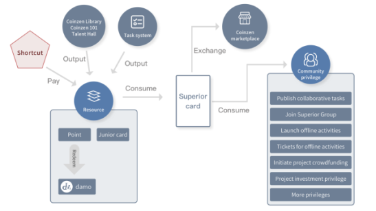

图：通证经济系统结构

Figure: The Architecture of Token Economics System

  为了满足通证投资价值与生态系统内的流通性，达摩平台采用TOKEN+积分机制，主要分为具有投资价值的damo和具有系统记账功能的积分,以及知识身份证明的非同质代币。

To meet the value of the token investment and the circulation within the ecosystem, Coinzen adopts the TOKEN + Points mechanism, including damo with investment value, Points with system billing function and non fungible token with proof of knowledge identity.

8.2. damo

damo

   是智能结算系统在交易所流通的价值媒介，持有者可以享受其流通所带来的投资收益，同时作为用户使用系统的凭证。damo一次性定量发行，永不增发，随着接入系统的用户数量增加，damo的价值也会不断提升，交易所的投资者与用户持有damo的意愿将不断增加。

 It is the value medium for the smart settlement system to circulate on the exchange. The holder can enjoy the investment income through its circulation, and at the same time serve as a credential to use the system. Damo is a one-time quantitative issue and will never be reissued. With the increase in the number of users, the value of damo will continue to increase, and the willingness of investors to hold damo will continue to rise.

8.3.积分

Points

   是系统的记账代币。积分主要起着系统内记账的作用，不直接在交易环节流通。积分可以直接按照市值兑换damo，且积分持有者享有优先兑换权。

 It is the system's billing token. Points mainly play the role of accounting in the system and do not circulate directly in the transaction. Points can be redeemed instantly for damo following the market value, and the holder of the points has the priority to convert.

8.4 知识身份证明非同质代币

Non Fungible Tokens with Proof of Knowledge Identity

   是社群中的一个通证。在我们常见的数据上区块链，一般较少涉及自身知识信息。我们发现了知识证明上链这一模式。把用户在币须达摩社区中，各个领域的答题成绩评估，写到区块链的代币中。作为一种知识和经验的证明，也可以在将来作为精英社群的入场券。知识身份证明非同质代币可作为特殊的商品进行交易。 

It is a community token. It’s common to upload the data to the blockchain, but the data is rare to involve own knowledge information. We have found the model of knowledge proof on the chain. The user's assessment of the scores in each area of the Coinzen community is written in the tokens of the blockchain. As a proof of knowledge and experience, it can also serve as an admission ticket for the senior community in the future. Proof of knowledge identity non fungible tokens can be traded as particular commodities.

1. **推广与运营**

**Promotion and Operation**

9.1 运营方

Operator

9.1.1运营价值观

Operational Values

   币须达摩是社群育成游戏平台，通过互动知识问答，辨论，以及立刻激励的方式，调动参与者的大脑系统一，让每一个参与进来的伙伴能知行合一地找到心流，掌握基于未来商业生态的协作方式，并通过链接创造价值。

Coinzen is a community- incubated game platform for cultivating participants' brain systems through interactive quizzes, debates, and direct incentives. Therefore, each participating partner will find the mental flow through the unity of knowledge and action and master an approach to creating value through links in a future business ecosystem.

​    因此，币须达摩运营核心价值观是让每一个参与进来的人都能找到快乐与意义感，并在快乐与意义感之间找到平衡。

Therefore, the core value of Coinzen operation is to allow everyone involved to find happiness and sense of meaning. They can also use the platform to build a balance between joy and a sense of purpose/meaning.

9.1.2 运营目标

Operational Vision

   通过币须达摩孵化出新一代的通证组织，即最理想的目标是通过币须达摩的知识问答等游戏竞争，涌现出很多个24人的协作群，称为“达摩院”，让各“达摩院”再协作创造，自然形成最强大的通证组织，成为强大的价值输出团体。

The vision of Coinzen is to incubate the new generation of organizations, which is Token Organizations. The ideal process is to compete through games such as the quiz system in Coinzen, and then many groups of communities consisted of 24 people will emerge, called the “Coinzen Academy.” Then each “ "Coinzen Academy" was created in collaboration and naturally formed the most potent group of Token organization and became an influential value-output group.

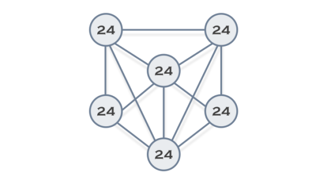

图：达摩院协作示意

Figure: Coinzen Academy Collaboration

9.1.3 运营思路

Operation Plan

   前期做区块链知识类育成平台，中期做多学科思维知识体系育成平台，后期做达摩区块链孵化器。

In the early stage, we will develop a blockchain knowledge education platform, and in the mid-term, we will develop a multidisciplinary knowledge education platform and later create a Coinzen blockchain incubator.

9.1.4 目标用户

Target Users

   对区块链感兴趣的人，对社群协作感兴趣的人，喜欢学习的人，要在区块链领域找到存在价值的人。

People who are interested in the blockchain, who are interested in the community collaboration, who are keen on learning, and who would like to find value in the blockchain domain.

9.1.5 发展阶段

Stages of Development 

   前期：增加小白用户基数，不断增加用户数量，提升用户质量，增加用户之间的连接频率。

Early period: To increase the scope of newbies, improve the quality of users, and raise the frequency of connections between users.

   中期：将小白培养升级为达人，打造区块链社群达人IP个人影响力。

Mid-term: To upgrade newbies to Talents and create individual influence power in blockchain.

   后期：项目将自动运行，淡化运营团队的力量，强化社群协作的力量，所以最后终将代币化运营，以代币激励社群为主。因为游戏中有damo消耗，每一位代币持有者拿着的damo，将随着社群的发展而增值。

Late period: The project will run automatically, diluting the power of the operations team, and strengthening the power of community collaboration, so it will eventually be token-operated, with token-based incentives for the community. Due to the damo consumption in the game, the damo held by each token holder will appreciate with the development of the community.

9.2 推广方案

Promotion Plan

9.2.1 社群推广

Community Promotion

   以区块链研习社已有的6000人付费社群为起点，通过社群激励的方式，迅速通过藏经阁的区块链问答游戏把项目传送到各社群成员，进行项目冷启动。

Starting from the existing 6,000-person paid community at Chainclub, through the community incentive approach, the project will be quickly sent to the members of the community through the Coinzen Library blockchain quiz to conduct a cold start of the project.

   通过与各大区块链社群合作，开放API，提供区块链知识问答游戏服务，达到引流的效果。

Through opening the API and cooperation with influential blockchain communities，Coinzen provides blockchain quiz game service to achieve the effect of introducing flow.

9.2.2 媒体推广

Media Promotion

   通过区块链研习社自媒体币须说在区块链媒体联盟的资源，迅速与各区块链媒体达成战略合作关系，打造媒体推广矩阵。

It will quickly establish a strategic partnership with blockchain media to create a media promotion matrix by the resources of Token talk which is We-Media platform of Chainclub.

9.2.3 商业合作

Business Cooperation

   联合区块链研习社问道区块链以及higer专访等，迅速与项目方对接，为项目方提供定制的专业题库，培养粉丝。

Coinzen will quickly connect with the project partners of Chainclub, Askingblockchain, and Higher Interviews to provide project experts with a customized professional question bank to  enlarge the number of their fans.

9.2.4 线下meetup

Offline Meetup

   与区块链研习社全国乃至海外各地分社共同打造线下meetup，让更多人了解项目。

Together with Chainclub branches in China and overseas to create the offline meetup, let more people understand the project.

9.2.5 线上活动

Online Activities

   在币须达摩系统里不定期加插小游戏，活跃社群气氛，拉动粉丝。

The Coinzen system will add some small games from time to time, active community atmosphere, pull fans.

9.2.6 社交平台

Social Platforms

   将在国内国外社交平台及时发布官方信息。

The team will release official information on time on Chinese and international social platforms.

9.2.7 第三方平台

Third-Party Platform

   与第三方入口平台合作，争取流量。如公信宝，欧链的eos pocket，网易区块链游戏等。

Coinzen will work with third-party portals to obtain flow, such as GXchain, Oraclechain Eos Pocket, NetEase blockchain games and so on.

1. **发展路线**

**Milestones**

   混沌

Chaos

   世界混沌阶段，直到创世达摩们将他们分开，从此有天有地。本阶段是币须达摩的团队开天辟地的时期，搭建币须达摩世界的基础设施，连接外部各大项目资源，引入足够多的人来组建社群。

At first, the world was in chaos, until the genesis Coinzener separated the world into heaven and earth. This stage is the time when the Coinzen team create the world, build an infrastructure of the Coinzen world, connect external project resources, and introduce enough people to form the community.

   化境

Sublimity

   自然精妙的境界。在此阶段，币须达摩世界将所接入的公链全部互通，让每一个公链的相关资源能互动互助。

Naturally exquisite realm. At this stage, all the public blockchains which have access to the Coinzen world will be connectivity. So, each related resource of the public blockchain can interact and support each other.

   破空

Epiphany

   顿悟而飞升跃迁。本阶段，达到达摩阶段的玩家将可以调用币须达摩上的各种特权资源实现自身的飞跃。

Epiphany and leap. At this stage, the player who becomes Coinzener will be able to call various privileged resources on Coinzen to achieve their leap.

2018 Q3

藏经阁上线

Coinzen Library launches

藏经阁上线区块链版本

Coinzen library (blockchain version) launches

2018 Q4

小白学堂上线

Coinzen 101 launches

小白学堂上线区块链版本

Coinzen 101 (blockchain version) launches

上线交易所

damo goes listing on exchanges

2019 Q1

达人馆上线

Talent Hall launches

卡牌合成功能上线

Identity cards synthesis function launches

达摩集市功能上线

Coinzen Market launches

 达摩院上线

Coinzen Academy launches

1. **分配方案**

**Issuance Scheme**

游戏名称：币须达摩

Name: Coinzen

代币符号：damo

Token symbol: damo

发行量：1亿

Issue Quota: 0.1 billion

官网：coinzen.top

Official Website: <http://coinzen.top>

Allocation proportion

团队2000万个

damo锁仓一年

用于技术团队与运营团队以及顾问团队的激励

Founding team, 20 million

One year lock

Award for the Technical team, operations team and consultant team

社区1500万个

1500万个由研习社基金会管理，用于发展社区，以及扩大知名度，活跃度等。

The community foundation, 15 million

15 million is managed by the Chainclub Foundation for the development of the community, as well as to increase awareness and activity.

币须达摩基金会：1500万个

5人管理，用于公益，品牌宣传，及一些突发应对。

Coinzen Foundation, 15 million

Operated by five persons, for public welfare, brand promotion, and some immediate response.

天使轮1000万个（已完成）

早期创投者投资，用于项目启动，主要对象是创始团队。

Angel round (finished), 10 million

Early investment, for project initiation, the primary target is the founding team.

私募2500万个

用于运营费用及上交易所费用

PE, 25 million

Used for operating expenses and expenses for listing on exchanges

推广运营，1500万个

用于品牌宣传

Promotion and operation, 15 million

Used for brand promotion

1. **团队介绍** 

**Team Members**

12.1 天使/团队

Angel investors and team members

吴伟龙 | 阿龙

中南大学

币须达摩创始人

区块链研习社联合创始人

亦来资本董事

币须说区块链自媒体核心成员

全球华人大学生区块链联盟联合创始人。

Weilong Wu

Graduated from Central South University

Founders of Coinzen

‎Chainclub co-founder

Elastos Capital director

Token talk core member 

GUSBU co-founder

欧阳敏华 | bonny欧阳

币须达摩联合创始人

教育领域连续创业者 

曾任某新三板创业教育公司广东省总经理

区块链研习社孵化事业部CEO

币须说区块链自媒体核心成员

Minhua Ouyang | Bonny AY

Co-founder of Coinzen

Successive Entrepreneurs in Education Field

Former Guangdong Province General Manager of a NEEQ-listed education entrepreneurship

Chainclub Incubation Division CEO

Token talk core member 

马超

币须达摩联合创始人

十一年全栈工程师

曾任某集团公司深圳分公司总经理

人民邮电出版社技术作者

传统技术公司合伙人，长期为华为、中兴提供技术支持。

Chao Ma

Co-founder of Coinzen

11-year Full Stack developer 

Former general manager of a Shenzhen branch of a group company

People's Posts and Telecommunications Press technical writer

Partner of a traditional technology company, long-term technical support for Huawei and ZTE.

 黎倚杭 | Smith

币须达摩联合创始人

六年C++开发

区块链极客，专注超级账本

比特股，以太坊，eos开发。

Yihang Li | Smith

Co-founder of Coinzen

Six years of C++ development, blockchain geeks, focus on Hyperledger, Hyperledger, Ethereum, eos development

吴迪

吉林大学

曾任华为云计算、区块链高级工程师

精通比特币及Fabric架构。

Di Wu

Graduated from Jilin University

Former senior engineer in cloud computing and blockchain at Huawei 

Proficient in bitcoin and fabric architecture.

12.2 顾问

Consultant

顾问团队

Consultant Team

Higer

中科院软件研究所硕士

区块链研习社创始人

超级天网项目技术顾问

问道区块链栏目创始人

前中国农业银行8年核心系统开发及区块链技术研究及应用研发经验

Higer

Master graduated in Chinese Academy of Sciences

Chainclub founder

Superskynet technical consultant

Askingblockchain founder

Former Agricultural Bank of China 8 years of core system development and blockchain technology research and applied R&D experience

菜菜子

币须达摩技术顾问

中南大学硕士

QYB及钱包开发负责人

比特币编程课、比特币源码研读班讲师

《精通比特币》中文版第二版作者之一

Sia维基中文翻译者

Charles | Caicai Zi

Coinzen consultant

Master of Central South University

QYB & Wallet Development Leader

Bitcoin programming class, Bitcoin source study class lecturer

One of the authors of the second Chinese edition of Mastering Bitcoin

Sia Wiki Chinese Translator

Andy

燕山大学硕士

《区块链大讲堂》创办者

《区块链落地应用》专栏讲师

曾参与金融、政务、工控、医疗等多领域区块链应用项目

区块链产品设计专家

Andy

Master of Yanshan University

Founder of Blockchain Lecture Hall

Lecturer of Blockchain Landing Application

Has participated in finance, government affairs, industrial control, medical care, etc. multi-domain blockchain application project

Blockchain Product Design Expert

王世胜

币须达摩项目顾问

区块链研习社联合创始人

区块链研习社成都分社长

区块链媒体币须说创始人

简书官方专栏主编

10余年项目管理经验

和通信巨头电信、移动、华为多年合作经验

Shisheng Wang

Coinzen consultant

Chainclub co-founder

Chengdu branch chief of Chainclub

Blockchain Media Token Talk founder

Editor-in-chief of Chainclub official column in JianShu

More than ten years of project management experience

Cooperate with telecom giants such as China Telecom, China Mobile, and Huawei many years

王祥鹏 Bruce

币须达摩投资顾问

区块链研习社达摩院成员

布鲁斯投资课讲师

区块链基金IOB经理

OMG 量子链 早期投资人

Xiangpeng Wang | Bruce

Coinzen investment consultant

Dharma member of Chinaclub

Bruce Investment Course lecturer

Blockchain Fund IOB Manager

OMG Quantum Chain Early Investors

韦豪 Ares

币须达摩投资顾问

电子科技大学软件工程硕士

奥德利区块链研究所中国区CEO

比特币早期投资者

股权投资基金合伙人

Hao Wei | Ares

Coinzen investment consultant

University of Electronic Science and Technology Master of Software Engineering

Audley Blockchain Institute China CEO

Bitcoin early investors

Equity Investment Fund Partner

Richard Fan

币须达摩投资顾问

区块链研习社达摩院成员

澳大利亚国立南澳大学MBA

历任飞利浦中国投资有限公司市场经理

美国Bridgeport Capital LLP对冲策略交易员

高申资产联合创始

Richard Fan

Coinzen investment consultant

Dharma member of Chinaclub

Australian National University of South Australia MBA

He has served as marketing manager of Philips China Investment Co., Ltd.

US Bridgeport Capital LLP Hedge Trader

Gao Shen Assets Joint Venture

1. **名词解释**

**Glossary**

13.1 DAO

DAO

   “分布式自治组织”，是Distributed Autonomous Organization的缩写，这是一种基于区块链的组织结构形式，如蚂蚁群，蜂群都有可以称之为DAO组织。

Abbreviation for Distributed Autonomous Organization, a blockchain-based organizational structure such as ant colony, swarm, both can be called DAO.

13.2 通证

Token

   Token的音译，是基于区块链底层技术发行的可信凭证，是价值的载体。

A trusted credential based on the underlying technology of the blockchain and is a carrier of value.

   通证组织：以人们的共识为基础，以区块链技术为信用保证，以前置智能合约为利益分配的DAO。通证组织从大多从虚拟社群中来，但又高于虚拟社群，通证组织更强调是的通过共识达成协作，从而创造价值，是一种新的生产关系。

Token Organization: DAOs that have previously placed smart contracts for profit distribution based on people's consensus and blockchain technology as a credit guarantee. Token Organizations are mostly from the virtual community, but they are higher than the virtual community. Token Organization emphasizes that the collaboration is based on the consensus to create value. It is a new production relationship.

13.3 Dapp

   分布式应用程序。

Distributed applications

13.4 虚拟社群

Virtual community

   1993年瑞格尔德（HowardRheingold）的在书中《虚拟社群：定居在电子前沿》定义：人们可以通过互联网相互连接，突破地域限制，彼此沟通交流、分享信息和知识，形成相近的兴趣爱好和情感共鸣，这种特殊关系网络就是“虚拟社群”。

Defined by Howard Rheingold in the book The Virtual Community: Homesteading on the Electronic Frontier (1993): People can connect with each other through the Internet, breakthrough geographical restrictions, communicate with each other, share information and knowledge, and form similar hobbies and emotional resonances. The special relationship network is the "virtual community."

13.5 阿尔法魔

Alpha Monster

   币须达摩们共同的对手，集体行动战胜之后，将全体增加积分。

Coinzener's common opponent. After winning the collective action, Coinzener will increase his/her points.

13.6 负熵内核

Negative entropy kernel

   生命依靠从外部环境摄取负熵来维持和发展的核心价值观与方法论

The core value and methodology of life that is maintained and developed by taking negative entropy from the external environment

13.7 二向箔

Two-Dimensional Foil 

   在中国科幻名匠刘慈欣的作品《三体III：死神永生》中登场的一种典型的维度打击（降维攻击）武器。宇宙在黑暗森林状态下，星际文明间一种极为基础的毁灭性武器。

A typical dimensionality attack (dimensionality reduction attack) weapon that appears in famous Chinese science fiction writer Cixin Liu's Death's End (Remembrance of Earth's Past). The universe is in the state of dark forests, so it is a primary devastating weapon among interstellar civilizations.

13.8利益相关者

Stakeholder

   是受组织决策和行动影响的任何相关者，即是与企业有利害关系的相关人员或机构，如股东、债权人、员工、顾客等等。

Anyone whom affected by organizational decisions and actions, It could be a relevant to the organization, such as shareholder, loaner, employee, customer,etc. 

13.9 达摩

Dharma

   菩提达摩（Bodhidharma）南北朝禅僧，略称达摩或达磨，意译为觉法，据《续高僧传》记述，南印度人，属刹帝利种姓，通彻大乘佛法，为修习禅定者所推崇。

In the Northern and Southern Dynasties of China (420-589), Zen Buddhism, known as Bodhidharma, was paraphrased as meaning of insight. According to the *Continuation of The Biographies of Eminent Monks*, he is a south Indians belonged to the Kshatriya caste and understood Mahayana thoroughly, and praised by meditator. Damo is a transliteration of Dharma.

13.10 心流

Mental flow

   在心理学中是一种某者在专注进行某行为时所表现的心理状态。

The state of mind that a person performs when he is focusing on activity in psychology.

\13. 11 比特世界

Bit World

   是基于区块链共识算法产生信用的物理世界的比特化映射，是将人财物等通证化的世界，它具有更高效率的协作关系，与更加公平透明的生产关系。

It is a bit-based mapping of the physical world based on the blockchain consensus algorithm to generate credits. It is a world in which people's property and other goods are tokenized. It has a more efficient collaborative relationship and a more fair and transparent production relationship.

13.12 结构洞

Structural cave

   指社交网络中的空隙，即社会网络中某个或某些个体和有些个体发生直接联系，但与其他个体不发生直接联系，即无直接关系或关系间断，从网络整体看好像网络结构中出现了洞穴。 

It refers to the gap in the social network, that is, one or more individuals in the social network have direct contact with some individuals, but they do not have direct contact with other individuals. In other words, there is no direct relationship or interruption of the relationship, from the whole network, it looks like there are caves in the network structure.

1. **风险与免责**

**Disclaimer**

   目前世界上主要国家对于区块链项目即使用加密货币融资的态度和政策尚不明确，存在由于政策原因造成投资者损失的可能性；

At present, the attitudes and policies of the major countries in the world are not explicit about the blockchain projects which use cryptocurrency financing, and there is a possibility that investors may lose due to policy reasons.

   包括damo在内的数字资产交易具有极高的不确定性，并且缺乏合理的监管，所有的加密货币都存在暴涨暴跌，受到庄家操控的风险；

The transaction of digital assets, including damo, has exceptionally high uncertainty and lacks proper supervision. All cryptocurrencies are subject to sudden rise and fall and are subject to the risk of dealer manipulation.

​    币须达摩团队将不遗余力实现白皮书中提出的目标，并积极探索项目更长远的发展空间，然而由于外部环境和内部资源的不确定性，我们将保留对白皮书描述内容进行迭代的权力。白皮书内容的所有变更我们并无主动告知义务，请参与者通过相关渠道及时了解更新；

The Coinzen team will spare no effort to achieve the goals set out in the white paper and actively explore the longer-term development space of the project. However, due to the uncertainty of the external environment and internal resources, we will retain the power to iterate the content described in the white paper. We did not take the obligation to inform all the changes in the contents of the white paper. Participants are supposed to update themselves through relevant channels.

   除上述风险外，由于加密货币投资仍然是一个崭新的领域，可能还有有各种我们尚未提及或尚未预料到的风险，请在充分了解风险的情况下理性参与。

In addition to the risks above, since cryptocurrency investment is still a brand-new field, there may be various risks that we have not yet mentioned or have not anticipated. Please participate rationally with the full understanding of risks.

白皮书最终解释权归达摩链科技有限公司所有。

Dharma Chain Technology Co.，Ltd owns the ultimate interpretation right of the white paper

公司名称：Dharma Chain Technology Co.，Ltd

Company Name：Dharma Chain Technology Co.，Ltd

日期：2018-05-01

Date ：2018-05-01